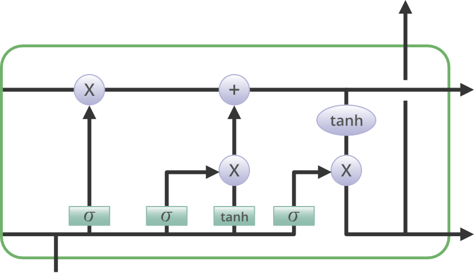
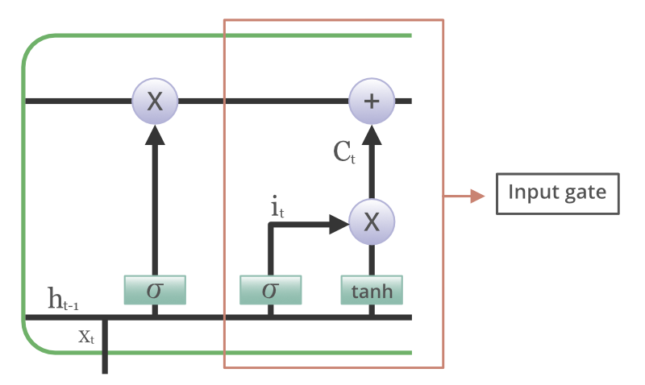
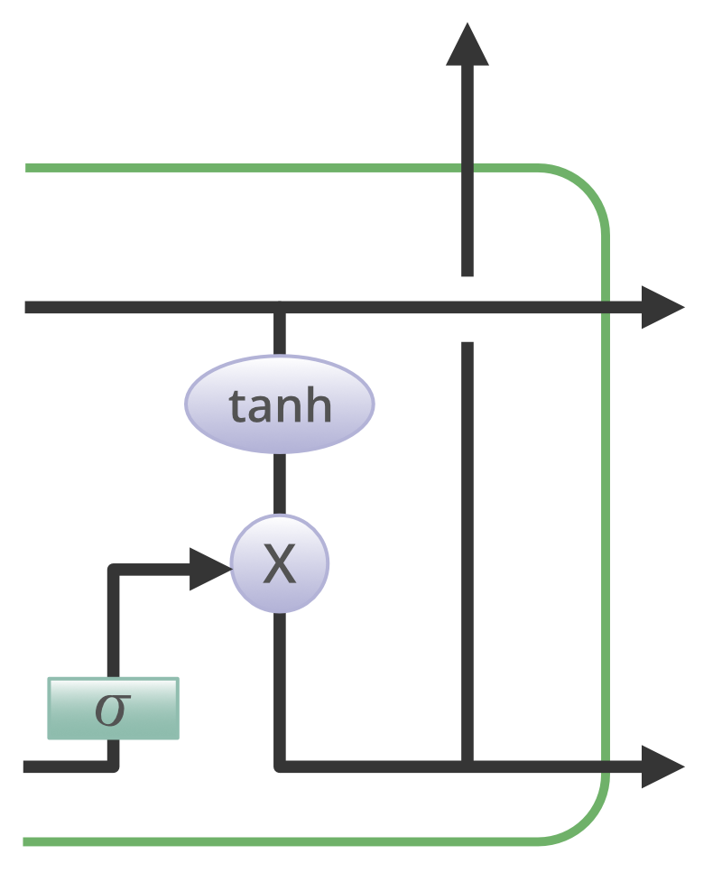

# Basic Architectures

## Vision

## NLP

Talk about **Recurrent Neural Network (RNN)** (TODO)

### LSTMs

Learning to store information over long time intervals using recurrent backpropagation is challenging. This is basically due to decaying error backflow. Long Short-Term Memory (LSTM) architectures were introduced in 1997 in @@cite{https://deeplearning.cs.cmu.edu/S23/document/readings/LSTM.pdf} as a solution for this problem. LSTMs use a novel gradient-based method to maintain constant error flow through special units with multiplicative gate units. LSTMs are efficient in both space and time, with a computational complexity of O(1) per time step and weight. Experiments in the original paper showed that LSTMs outperformed other recurrent network algorithms in terms of successful runs and learning speed, and they can solve complex tasks that previous algorithms could not.

LSTMs capturing the **long-term dependencies** in sequential data -such as time series or natural language- makes them suitable for tasks like speech recognition, language modeling, and time-series forecasting.

LSTMs introduce **memory cells** and **gates** in its architecture to control the information flow. These elements help the network decide which information to keep, which to forget, and which to update, allowing it to retain important information over long sequences.

Below is a diagram of an LSTM:

1. **Cell State $c_t$**
   - Acts like a memory that runs through the entire sequence, carrying relevant information across time steps (acts like a conveyor belt.)
   - The gates of the LSTM can add or remove information from the cell state, performing the regulation of the information flow.

2. **Hidden State $h_t$**
   - Used as the output of the LSTM cell at each time step. It also contributes to updating the cell state.

3. **Gates**
   
   LSTMs use **three gates** to regulate the flow of information:

   - **Forget Gate** $f_t$
   
     - Decides what information should be discarded from the cell state.
     - Two inputs $x_t$ (input at the particular time) and $h_{t-1}$ (previous cell output) are fed to the gate and multiplied with weight matrices followed by the addition of bias. 
     - Output is a number between 0 and 1 (using a sigmoid activation), where 0 means "totally forget" and 1 means "retain all."
     - Formula: 
       $$
       f_t = \sigma(W_f \cdot [h_{t-1}, x_t] + b_f)
       $$
     - Here, $W_f$ is the weight matrix, $h_{t-1}$ is the previous hidden state, $x_t$ is the current input, and $b_f$ is the bias.

   
        
        <!--  -->
    

   - **Input Gate** $i_t$ and **Candidate Cell State** $\tilde{c}_t$
     - The input gate decides which new information to add to the cell state. 
     - The candidate cell state represents new potential values that could be added to the cell state. 
     - Information is regulated using the sigmoid function and the values to be remembered are filtered -in similar manner as the forget gate- using inputs $h_{t-1}$ and $x_t$. Then, a vector is created using the tanh function that gives an output from -1 to +1, containing all the possible (potential) values from $h_{t-1}$ and $x_t$. Finally, the potential values of the vector and the regulated input values are multiplied to obtain useful information.
     
     - Formulas:
       $$
       i_t = \sigma(W_i \cdot [h_{t-1}, x_t] + b_i)
       $$
       $$
       \tilde{c}_t = \tanh(W_c \cdot [h_{t-1}, x_t] + b_c)
       $$

        

   - **Output Gate** $o_t$
     - Determines what part of the cell state will be output as the hidden state.
     - First the information of the inputs $h_{t-1}$ and $x_t$ is regulated and filtered again with the sigmoid function. Then a vector is generated by applying the tanh function on the cell (not shown in formula). Finally, the values of the vector and the regulated values are multiplied to be sent as an output and hidden state to the next cell.
     - Formula:
       $$
       o_t = \sigma(W_o \cdot [h_{t-1}, x_t] + b_o)
       $$

        

### Step-by-Step Operation

1. **Forget Gate Calculation**
   Decides which information to discard from the cell state based on the previous hidden state $h_{t-1}$ and the current input $x_t$.

2. **Input Gate and Candidate Cell State Calculation**:
   The input gate calculates what new information to store in the cell state and the candidate cell state $\tilde{c}_t$ is created as a new candidate for updating the cell state.

3. **Update the Cell State**:
   - The cell state $c_t$ is updated as follows:
     $$
     c_t = f_t \cdot c_{t-1} + i_t \cdot \tilde{c}_t
     $$
   - The previous cell state $c_{t-1}$ is scaled by the forget gate, while the new candidate cell state is scaled by the input gate.

4. **Output Gate and Hidden State Calculation**
   - The hidden state $h_t$ is calculated using the updated cell state and the output gate:
     $$
     h_t = o_t \cdot \tanh(c_t)
     $$

### Key Features
- **Memory Capability** LSTMs can retain information over long sequences because the gates control the flow of information, mitigating the vanishing gradient problem.
- **Sequential Processing** Suitable for processing data that comes in sequences (e.g., time series, text).
- **Bidirectional Variants** LSTMs can be extended to **bidirectional LSTMs**, where information is processed in both forward and backward directions, improving context comprehension.

### Use Cases
- **Natural Language Processing** Language modeling, machine translation, and speech recognition.
- **Time-Series Forecasting** Stock price prediction, weather forecasting, and anomaly detection.
- **Audio Processing** Speech synthesis, music generation, and audio classification.

### GRUs

GRU stands for Gated Recurrent Units. The so-called recurrent units have also a gated circuit to effectively and adaptively capture dependencies of different time scales. Their update gate and reset gate act in a similar way as the input and forget gates in LSTM. The update gate selects what information moves forward, whereas the reset lies in between two recurrent units deciding how much information to forget. 

TODO Complete