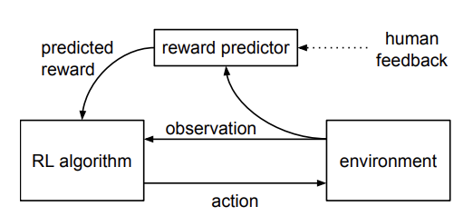
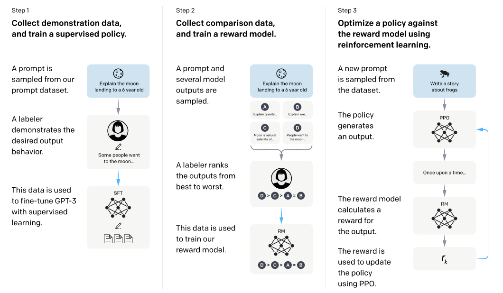

# Generative AI

## Origins of Generative AI

We can say that Generative AI has been an active area of research since -at least- the decade of 1960s, although it wasn't referred like that. During the period of 1964 to 1967, J. Weizenbaum developed what we can consider one of the first expert systems with the form of a chatbot, [ELIZA](origins.md#expert-systems) {@@cite weizenbaumELIZAComputerProgram1966}. At that time, it looked like computers where going to take over the work of many experts; the posibilities seemed endless. However the optimism came to an end with the [AI Winter of the 70s](origins.md#ai_winter_70s).

If we fast forward in time to the last few-years, the now called Generative AI -or just GenAI- has revolutionized (again?) the field of artificial intelligence. The generative models enable machines to create content that is becoming indistinguishable from human-generated content. Although not completely fair, the recent origins of this transformative technology can be traced back to the development of the Generative Pre-trained Transformer (GPT) models and their parent company, OpenAI.

We can put the first significant milestone in the release of the original GPT paper in 2018 {@@cite radfordImprovingLanguageUnderstanding}. Originally entitled "Improving Language Understanding by Generative Pre-Training", the model presented in the paper demonstrated the power of pre-training a [transformer architecture](transformers.md) with a large corpus of text data and then subsequently fine-tuning it for specific tasks. GPT  followed the original transformer work {@@cite vaswani_attention_2017}, having a 12-layer decoder-only transformer blocks with masked self-attention heads with 768 dimensional states and 12 attention heads. The total number of parameter was 117 million, which was a significant achievement at the time (although BERT large had 340M). This contrasts the bi-directional encoder-decoder transformer architecture of [BERT](nlp.md#bert) (also published in 2018) {@@cite devlin}.

The success of the original GPT model just set the groundwork for more advanced models in the forthcoming years. OpenAI introduced GPT-2 in 2019 {@@cite radfordLanguageModelsAre}. First, GPT-2 showcased a significant leap in scale, getting 1.5 billion parameters. But also in performance, as this model was capable of generating coherent and contextually relevant text, pushing the boundaries of what was possible with GenAI.

GPT-3 was released the following year, 2020; and it marked another significant milestone in the evolution of generative models. Again, it's an order of magnitude larger than its predecessor, reaching the ashtonishing figure at that time of 175 billion parameters. The massive increase in scale allowed GPT-3 to generate even more coherent and contextually accurate text, making it one of the most powerful language models ever created.

Architecturally, GPT-3 was not very surprinsing; it followed the same transformer-based design as its predecessors. However, it benefited from an extensive training process on a selected and diverse set of datasets. This enabled GPT-3 to perform a wide range of NLP tasks this time with minimal fine-tuning, including translation, question-answering, and creative writing.

The release of GPT-3 beyond demonstrating the potential of large-scale generative models, started sparking discussions about the ethical implications and societal impact of this new breed of powerful AI technologies.

But maybe was on November 30, 2022 when the true inflection point for GenAI became aparent; In those days, during the annual Neurips conference, OpenAI released the so-called ChatGPT. This chatbot -like many others before- was an experimental AI model, but quickly became viral due to the "sensation" it created for the users of "being truly chatting with some other persona" on the other side.

According to OpenAI, ChatGPT was fine-tuned from GPT-3.5 series models on an Azure AI supercomputing infrastructure. It re-introduced the so-called Reinforcement Learning from Human Feedback (RLHF) technique, presented in the paper InstructGPT {@@cite ouyangTrainingLanguageModels2022} in January of 2022, with minor differences in the data collection process.

The human-supervised fine-tuning task, means that humans "trained an AI" by providing examples of dialogues/conversations playing the two roles: a human and an AI. These humans were given specific training to help them with that task. These dialogues were mized with the transformation of the original InstructGPT dataset into a dialogue format.

The reinforcement learning (RL) part comes into play when a reward model for reinforcement learning has to decide which one of two or more responses is better using a technique called Proximal Policy Optimization (PPO) during several itereations. In order to do that, a comparison dataset had to be collected/created, rainking 2+ responses by quality. To do so, from the human-AI dialogues mentioned above, model-written responses where randomly selected and some completions were then subsequently sampled, having the AI trainers to rank them.

All these pioneering efforts have paved the way for subsequent advancements in the field, leading to the development of even more sophisticated models that continue to shape the future of AI-driven content generation.

## Large-Language Models (LLMs)

In order to define a Large-Language Model (LLM) in simple terms, we could say that it is essentially a neural-based machine learning model with billions of parameters (in contrast to BERT, RoBERTa, etc.), and which has been trained on vast amounts of textual data (See Scalling Laws). After reaching a certain number of parameters, these models can understand, generate, and manipulate human language in a coherent and contextually relevant manner (emergent properties). Examples include OpenAI’s GPT-4 and GPT-3, which can perform downstream tasks like translation, summarization, question-answering, or creative writing.

### Prompting

In simple terms we can describe prompting as "the art of specifying inputs to an LLM/GenAI system to get back what we asked for". More formally, we can describe a prompt as the input we give to a generative AI model to guide its output. The input can be multi-modal, that is, text, images, audio, video, or a combination of some of them. Prompts are usually pre-pended before the task specification that we want to achieve.

The concept is not new to GenAI, and it was preceded by related ideas like control codes and writing prompts (@@cite{Pfaff, 1979}, @@cite{Poplack, 1980}). More recently, the use of natural language prompts to elicit behaviors from language models predates GPT-3 and ChatGPT, with GPT-2 and earlier works by @@cite{Fan et al. 2018} using prompts.

Usually, a prompt consists of a *prompt template* that conforms a reusable structure that includes some placeholders/variables that will be filled at prompt composition time; so then we can see a prompt as an instance of the template with the variables filled in.

In the paper @cite{prompting} it is presented a taxonomy for organizing the various techniques and methods of structuring prompts to achieve specific outcomes. It divides the techniques mainly into text-based, multimodal and agentic categories. Text-based techniques encompass few-shot prompting (providing a few examples in the prompt), zero-shot prompting (providing no examples), chain-of-thought prompting (leading the model to articulate its reasoning step-by-step), and different ensembling methods (merging multiple prompts). Regarding multimodal techniques, many of those build on top of text-ones, exploring techniques for image prompting, audio prompting, video prompting, and even 3D prompting. LLM-based agents @@@cite{agents.md#Agents} are AI systems that use LLMs to achieve goals by interacting with external tools or systems. This allows to expand the capabilities of an LLMs beyond their inherent (but static) knowledge. For example, an agent might use a calculator to help solving a math problem or search the internet for up-to-date information.

Prompt engineering generates security concerns in the same way as in the past, for example, web technologies did. Prompt injection (malicious input overriding intended instructions) and jailbreaking (tricking the model into unintended behavior) are some of the common threats observed as of today. With prompts, there is also risk of alignment issues, such as biasing (even more) the LLM outputs, overconfidence generation on the result provided, and/or ambiguity in the prompt content.

Interestingly, the defense mechanisms to tackle security concerns may include also prompt-based defenses (e.g. by adding instructions to the prompt to prevent malicious input), guardrails (rules and frameworks to guide model outputs), and detectors (tools to identify malicious prompts). However, it is foreseen that this hacking will still be a significant challenge in the next few years.

### Fine-Tuning and LLMs

In the realm of LLMs, apart from promting, we can improve the knowledge of particular LLMs by means of fine-tunning. The [fine-tunning](vocabulary.md#fine-tunning) process -that is, the process of adapt an already pre-trained model with general knowledge to a specific domain/task- can be though -for example- in terms of teaching the model the specifics of a particular product documentation, or adapting it to an internal corpus of collected customer feedback data to help identifying the most relevant suggestions.

Full fine-tunning can achieve better metrics in the downstream tasks at the expense of collecting enough supervised samples for the finetuning dataset or overfit (or poorly learn stably) when using on small datasets. Also in contrast to other methods below, full fine-tuned models may lack out-of-distribution generalization capabilities.

Apart from the traditional fine-tunning, other fine-tunning techniques have been done for LLMs; these include PEFT, Instruction-tunning, RLHF, DPO, PPO.

## Parameter-Efficient Fine-Tunning (PEFT)

PEFT {@@cite Parameter-Efficient Fine-Tuning for Large Models: A Comprehensive Survey} refers to a set of techniques that update only a small fraction of model parameters; the rest of the parameters are "frozen" by disabling the backward pass. Some of the techniques included here are:

* *Additive PEFT or Adapter-tuning* Additional task-specific layers are inserted in between the layers of a pre-trained LLMs; only the parameters in this new layers will be updated.
* *LoRA* or *Low-Rank Adaptation* adds small blocks of adaptor weights that are low rank approximations (a.k.a. update matrices) of the original weight matrices (which became frozen). Advantages are related to 1) being more memory efficiency while not adding inference latency, mitigating catastrophic forgetting, and 2) not introducing additional inference latency.
* *Prefix-tuning* is inspired by prompting. It adds learnable vectors prepended to keys *k* and values *v* in the Transformer layers. A MLP layer is used to generate these prefix vectors (reparameterization strategy). The prefix consists entirely of free parameters (do not correspond to real tokens) and during tuning, only these prefix parameters are updated (the pre-trained model parameters are frozen).  After the fine-tuning, the prefix vectors will be the ones used in inference. 

## Instruction Tunning

Fine-tuning with instruction tunning refers to the use of supervised samples to "align" or "tame" the model; usually these supervised samples are a set of collected tasks rephrased as instructions to follow. In this case, during fine-tuning, all model parameters will be updated during. The instruction fine-tuning improves the performance of zero-shot scenarios on unseen tasks. It was considered one of the main important techniques in NLP in the early years of LLM dominance.

## Reinforcement Learning from Human Feedback (RLHF)

RLHF can be see as a superset of instruction-tuning technique; As we'll show below, it adds some more steps after the instruction-tuning step to ensure the models are less biased and more aligned with the so-called "human preferences" {@@cite Aligning Large Language Models with Human Preferences through Representation Engineering}, which includes toxicity, untruthfulness reduction, etc. 

The original technique is described in the DeepMind/OpenAI paper from 2017 {@@cite Deep reinforcement learning from human preferences}. In that paper the authors show a solution suitable for sequential decision problems that do not have a clear reward function and which can:

1. allow non-experts "to drive" agents behaviours based on their feedback
2. enable solving tasks for which only the desired behavior is know, but does not necessarily demonstrate it
3. scale to large problem domains
4. be cheap from the user feedback tasks point of view

The figure above depicts the solution proposed, which learns a reward function aligned to the human preferences and trains simultaneously a particular policy to optimize the current predicted reward function. In the human in the loop factor of the algorithm, humans are shown short videos of the agent's behaviour and are asked to decide which is better. The authors claim that, 1) humans are better and faster at doing this kind of feedback task rather than having to provide a response based purely on numerical score, and 2) prove that the obtained feedback is useful in helping the agent learning from the human preferences.

The following is the generic RLHF process published in the InstructGPT paper in 2022, adapted to the LLM-based scenarios from the RL realm were was originally published.

The RLHF process consists of:

### 1. Data Collection

1. Hire 40 contractors to label data based on their performance on a screening test.
2. Collect a dataset of human-written demonstrations of desired output behavior on prompts.
3. Collect a dataset of human-labeled comparisons between model outputs on a larger set of API prompts.

### 2. Supervised Learning Baseline

After the collection of the human-written demonstrations dataset for the desired model behavior, we will train a supervised model that will learn a baseline.

### 3. Reward Model (RM) Training

Then, we will collect another dataset of comparisons between 1) model outputs for a particular input, and 2) the preference of labelers, which will indicate which output they prefer for the given input. After that, we'll train a reward model on the dataset of human-labeled comparisons to predict preferred model outputs.

### 4. Fine-Tuning with PPO

In this step we will take the reward model and we'll optimize a policy against it using RL. So we will:

1. Use the reward model as a reward function.
2. Fine-tune the supervised learning baseline to maximize the reward using the PPO algorithm (see below).

Steps 2, 3 and 4 can be pipelined in a virtuous circle; new comparison data can be collected on the current best policy, which will be in turn used to train a new reward model and subsequenty after that, a new policy.

### 5. Evaluation

1. Evaluate models by having labelers rate the quality of model outputs on a test set.
2. Conduct automatic evaluations on public NLP datasets.
3. Train models of different sizes (1.3B, 6B, and 175B parameters) using the same GPT architecture.

RLHF comes with the so-called *alignment tax*, which is a slight penalty on model performance in certain downstream tasks.

### Proximal Policy Optimization (PPO)

Proximal policy gradient methods come from the Reinforcement Learning realm {@@cite Proximal Policy Optimization Algorithms}. Traditional policy gradient methods directly learn an optimal policy -a mapping from states to actions- adjusting its parameters to maximize expected cumulative rewards; they usually perform only one update per data sampled from the environment, which limits their efficiency and may lead to unstable learning. 

In contrast, Proximal Policy methods, sample a minibatch of data through interaction with the environment, and alternates those samples with the optimization of a “surrogate” objective function using SGA. This function has "clipped probability ratios" that allows for multiple epochs of minibatch updates, but limit the size of policy updates (avoiding large policy updates), which results in a more stable and efficient learning process. The probability ratio represents the change in action selection probability. In PPO it is clipped to a certain range (1-epsilon to 1+epsilon), preventing drastic changes that could destabilize learning, ensuring more gradual and reliable improvements. The clipping mechanism is adaptive, so it will react differently depending on whether the advantage is positive or negative. This is key to maintain a balance between exploration and exploitation, which in turn enhances stability.

The PPO algorithm can be seen as a loop iterating through these steps:

1. Multiple actors run the current policy in the environment for a fixed number of timesteps, collecting data. 
2. Advantage estimates are computed for each timestep. 
3. The surrogate loss function, which incorporates the clipped probability ratios, is optimized using minibatch SGD (often with Adam optimizer) for a number of epochs. 
4. The old policy parameters are updated with the newly optimized parameters. 

The loop is repeated until a termination condition is met.

### DPO

In contrast with PPO, Direct Preference Optimization or DPO {@@cite Direct Preference Optimization: Your Language Model is Secretly a Reward Model}, is a more simple, stable, performant, computationally lightweight implementation to align LLMs with human preferences.

The DPO paper @@cite{} proposes an approach to fine-tuning LLMs also using human preferences but bypassing the complexities of reinforcement learning proposed the PPO method.

As we saw above, reinforcement Learning from Human Feedback (RLHF) implies a multi-stage process; 1) training a reward model to capture human preferences, and 2) using reinforcement learning to optimize the LLM's policy to maximize this reward. Despite it success, it's known for being computationally expensive, unstable, and requiring significant [hyperparameter tuning](vocabulary.md#hyper-parameter tuning).

Direct Preference Optimization (DPO) in contrast, instead of explicitly training a separate reward model, it makes a reparameterization of the reward function in terms of the LLM's policy itself (that is, the reward model is implicit). This opens for a direct optimization of the policy using a simple classification loss, eliminating the need for the reinforcement learning loop.

The core idea of the technique is to leverage the analytical relationship between a reward function and its corresponding optimal policy under a [KL-divergence](vocabulary.md#kullback-leibler-kl-divergence) constraint. Given a reference policy (often just the original pre-trained LLM), the reward function can be expressed directly in terms of the optimal policy and the reference policy. In this way, the optimization is re-framed as a maximum likelihood estimation problem over the policy parameters.

As result, the DPO updates increase the log probability of preferred responses while decreasing the log probability of dispreferred responses.  Crucially, it incorporates a dynamic importance weight assigned to each example, based on how well the current implicit reward model aligns with the observed preferences. This weighting helps in preventing the model degeneration, a problem observed if a naive probability ratio objective is used.

Compared to PPO, experiments across different tasks, such as sentiment generation, summarization, and dialogue tasks, show that DPO:

1. consistently matches or outperformed existing methods, including PPO-based RLHF.
2. achieves a more efficient reward-KL divergence trade-off, demonstrating superior optimization of the underlying RLHF objective. 
3. shows greater robustness to changes in sampling temperature.
4. removing the RL loop and the simpler loss function leads to substantial computational savings and faster training times.

## New Architectures Beyond the Transformer