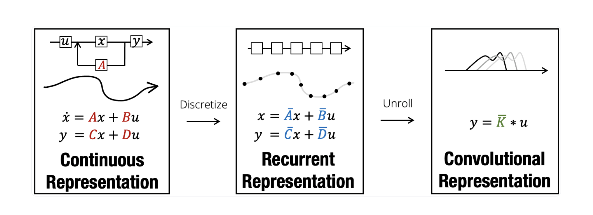

# New Architectures Beyond the Transformer

## State Space Models (SSMs)
SSMs have been used in signal processing, control process, econometrics, and ML to model time-series data and dynamic systems by means of the so called state-variables.

Hidden Markov models (HMMs) and recurrent neural networks (RNNs), are well-known ML/DL architectures that use state space models to capture temporal dependencies.

SSM is an excellent model for describing the “time cells” present in the brain (hippocampus and cortex in particular). In @@cite{Improving Spiking Dynamical Networks: Accurate Delays, Higher-Order Synapses, and Time Cells } neuroscientists described how spiking neural networks can be improved by extending the neural engineering framework (NEF) to include a variety of synapse models. The aimed goal of these extension is help to understand how synaptic properties affect network computations, specially how the brain represents temporal information. The paper shows both analog and digital simulations and demonstrates the utility of these extensions through various examples, such as mapping an optimal delay line onto spiking networks. The findings also offer a new explanation for time cell responses observed in different brain regions (hippocampus and cortex in particular). The main contributions due to the extensions that the authors cite are:

1. Improved Accuracy for Neuromorphic Systems: The extension enhances the NEF by allowing for better accuracy in systems with mixed-analog-digital synapses, addressing higher-order dynamics and biological constraints like finite rise times and action potential delays.

2. Enhanced Understanding and Performance: It advances the understanding of synapse- and network-level dynamics, enabling accurate discrete-time simulations of continuous neural dynamics and effective implementations of delay networks. This provides new insights into temporal properties of cell activity and applies to both linear and nonlinear systems.

The authors of that paper, Voelker and Eliasmith applied later that work in the field of DL in the paper @@cite{Legendre Memory Units: Continuous-Time Representation in Recurrent Neural Networks}. 

More recently the work of A. Gu et al. @@cite{Efficiently Modeling Long Sequences with Structured State Spaces”}. This work introduces the Structured State Space, or S4, model. S4 manages to handle efficiently long-range dependencies in sequence data, which is a challenge for traditional models like RNNs, CNNs, and Transformers. The main innovation is a novel parameterization of state space models (SSMs), which enables the model to process long sequences efficiently (10,000+ steps) with reduced computational and memory requirements. 

### Key Concepts of a State Space Model

1. **State**
    Represents the internal condition or configuration of the system at a given time. It captures all the necessary information about the system to predict its future behavior. Typically denoted as a vector $x_t$, where t is the time step or index.

2. **State Transition Equation**
    Describes how the state evolves from one time step to the next. The general form is $x_{t+1} = A x_t + B u_t + w_t$

    $A$ is the state transition matrix, which determines how the current state affects the next state 
    
    $B$ is the input matrix, which determines how the external inputs influence the state.

    $u_t$  represents any external inputs to the system.
    
    $w_t$  is the process noise, representing random variations or uncertainty in the system.

3. **Observation Equation**
    Relates the internal state to the observable outputs. The general form is $y_t = C x_t + D u_t + v_t$

    $y_t$ is the observed output at time t.

    $C$ is the observation matrix, which determines how the state affects the observations.

    $D$ is the matrix for the influence of external inputs on the observations.

    $v_t$ is the observation noise, representing measurement errors or uncertainty in the observations.

### Components Explained

* *State vector* $x_t$: Encodes the system’s internal variables that evolve over time.
* *Input vector* $u_t$: Represents external forces or influences that affect the system’s state.
* *Output vector* $y_t$: The actual measurements or observations from the system.
* *Noise terms*  $w_t$  and $v_t$: Capture uncertainties in the state transition and observations.

### Simple Example

For example, for a robot moving in a straight line:

* State: The robot’s position and velocity at time $t$.
    $x_t = \begin{bmatrix} \text{position}_t \\ \text{velocity}_t \end{bmatrix} $

    *Position* The robot’s location along the line.
	
    *Velocity* The speed at which the robot is moving.

* State Transition Equation:

    The new position depends on the old position plus the velocity.
    
    The velocity may change based on acceleration (input).
    $x_{t+1} = A x_t + B u_t + w_t$, where $u_t$ is the acceleration.

    Let’s say we are working in discrete time steps. The state transition matrix $A$ could be:

    $A = \begin{bmatrix} 1 & \Delta t \\ 0 & 1 \end{bmatrix}$

    Where $\Delta t$ is the time step between measurements. This matrix indicates that the new position is updated based on the current position plus velocity times $\Delta t$, and the new velocity remains the same (if there’s no acceleration input).

    The input matrix $B$ could be:

    $B = \begin{bmatrix} 0.5 \Delta t^2 \\ \Delta t \end{bmatrix}$

    This matrix indicates that acceleration affects both the position (through $0.5 \Delta t^2$) and the velocity (through $\Delta t$).

    So, the state transition equation becomes:

    $\begin{bmatrix} \text{position}_{t+1} \\ \text{velocity}_{t+1} \end{bmatrix} = 
    \begin{bmatrix} 1 & \Delta t \\ 0 & 1 \end{bmatrix}
    \begin{bmatrix} \text{position}_t \\ \text{velocity}_t \end{bmatrix} • \begin{bmatrix} 0.5 \Delta t^2 \\ \Delta t \end{bmatrix} u_t + w_t$

* Observation Equation: The robot’s position may be observed with some measurement error.

    $y_t = C x_t + v_t$, where $C$ maps the state to the measured position.

    $y_t$ is the observed position.
	$C$ maps the state to the measured position, which could be:

    $C = \begin{bmatrix} 1 & 0 \end{bmatrix}$

	$v_t$ represents measurement noise.

Now let's suppose that the robot starts at position 0 with a velocity of 1 m/s ($\begin{bmatrix} 0 \\ 1 \end{bmatrix}$), and we apply an acceleration of 0.2 $m/s^2$. The model could predict the robot’s position and velocity over time using the state space equations:

1.	Initial state:  $x_0 = \begin{bmatrix} 0 \\ 1 \end{bmatrix}  (position = 0, velocity = 1)$.
2.	Apply state transition: Calculate the new state using the matrices and input.

    2.1	State transition matrix $A$:

    $A = \begin{bmatrix} 1 & \Delta t \\ 0 & 1 \end{bmatrix} = \begin{bmatrix} 1 & 1 \\ 0 & 1 \end{bmatrix}$

    So, $A x_t$:

    $A x_t = \begin{bmatrix} 1 & 1 \\ 0 & 1 \end{bmatrix} \begin{bmatrix} 0 \\ 1 \end{bmatrix} = \begin{bmatrix} 1 \times 0 + 1 \times 1 \\ 0 \times 0 + 1 \times 1 \end{bmatrix} = \begin{bmatrix} 1 \\ 1 \end{bmatrix}$

	2.2. Input matrix $B$:

    $B = \begin{bmatrix} 0.5 \Delta t^2 \\ \Delta t \end{bmatrix} = \begin{bmatrix} 0.5 \times 1^2 \\ 1 \end{bmatrix} = \begin{bmatrix} 0.5 \\ 1 \end{bmatrix}$

    So $B u_t$:

    $B u_t = \begin{bmatrix} 0.5 \\ 1 \end{bmatrix} \times 0.2 = \begin{bmatrix} 0.5 \times 0.2 \\ 1 \times 0.2 \end{bmatrix} = \begin{bmatrix} 0.1 \\ 0.2 \end{bmatrix}$

    Which results (assuming zero measurement noise for simplicity, i.e., $w_{t+1} = 0$):

    $x_{t+1} = A x_t + B u_t = \begin{bmatrix} 1 \\ 1 \end{bmatrix} + \begin{bmatrix} 0.1 \\ 0.2 \end{bmatrix} = \begin{bmatrix} 1.1 \\ 1.2 \end{bmatrix}$

    The new state after applying the state transition is:

	1. Position: 1.1 meters
	2. Velocity: 1.2 meters/second

3. Observation Equation in $t+1$ (Let's check the facts of the state transition in the updated state):

    The general form of the observation equation is: $y_t = C x_t + v_t$

    Let’s assume that we only measure the robot’s position, not its velocity. The observation matrix $C$ would then be: $C = \begin{bmatrix} 1 & 0 \end{bmatrix}$

    This matrix indicates that we are only observing the first component of the state (the position) and ignoring the second component (the velocity). Given the updated state:

    $x_{t+1} = \begin{bmatrix} 1.1 \\ 1.2 \end{bmatrix}$

    We can calculate the observed position $y_{t+1}$ (assuming zero measurement noise for simplicity, i.e., $v_{t+1} = 0$):

	$y_{t+1} = C x_{t+1}$ $=>$ $y_{t+1} = \begin{bmatrix} 1 & 0 \end{bmatrix} \begin{bmatrix} 1.1 \\ 1.2 \end{bmatrix} = 1 \times 1.1 + 0 \times 1.2 = 1.1$

    So, the observed output at time $t+1$ is 1.1 meters.

4.	Repeat: Use the updated state as the input for the next time step, iterating over each time step.

### State Space Model and S4

[S4 builds on the core principles of SSMs](https://hazyresearch.stanford.edu/blog/2022-01-14-s4-3) to design a highly efficient and scalable framework for handling long sequences of text. It uses techniques such as discretization, the HiPPO framework, and efficient parameterization to address the limitations of traditional models (e.g. RRNs) while retaining the benefits of state space representations, excelling in tasks involving long-range dependencies.

As we've introduced above, SSMs are mathematical frameworks used to describe the evolution of a complex system’s internal state over time. 
In S4, the SSM is represented by the continuous-time equations:

$x{\prime}(t) = A x(t) + B u(t)$

$y(t) = C x(t) + D u(t)$

Where:
1. $x(t)$ represents the internal state (analogous to position and velocity in the robot example).
2. $A$, $B$, $C$ and $D$ are matrices that define how the state evolves and how observations are generated.
3. $u(t)$ is the input signal, and $y(t)$ is the observed output.

In the S4 paper, matrix $D$  is considered for completeness but is often omitted or set to zero for several practical reasons.

#### Handling Long-Range Dependencies

Long-range dependencies refer to the ability of a model to capture relationships in the data over long sequences (e.g., 10,000+ steps) whihc is also called input context (or input tokens). Models like RNNs and Transformers have challenges with vanishing and exploding gradients or high computational costs for long sequences ($O(n^2)$). The S4 paper addresses this by leveraging the state space model structure to efficiently compute sequences while preserving long-term information.

 #### Discretization and Efficient Computation

S4 defines a State Space Model (SSM) using a continuous-time system which then is discretized it to show its recurrent and then convolutive view. 

So, in practice, the continuous-time SSM is discretized to work with discrete sequences (e.g., text or time-series data). This transforms the continuous equations into a sequence-to-sequence map, similar to how we discretize the time steps for the robot’s motion. S4 uses a clever parameterization to convert the SSM into a large 1D convolution -which can be computed in parallel- making it suitable for long sequences.

Discretization is probably the key idea in S4. The efficiency of this architecture lies in this step, as it enables moving from a continuous view of the SSM to its two other views: the recursive and the convolutive view.

This will enable us to train the model convolutely and then perform inference recursively over very long sequences.

This image from the blog above summarizes the process visually:

#### The HiPPO Framework

In the robot example, we saw how the state transition matrix $A$ and input matrix $B$ affected the evolution of the state. In S4, a specific initialization technique called HiPPO (Highly Oscillatory Polynomial Projection Operator) is used to encode long-range dependencies effectively. HiPPO optimizes the state matrix $A$ to better remember past information, similar to how the matrices in the robot example determined how previous states influenced the current state.

#### Observation and Output Generation

The observation equation in SSMs relates the internal state to the output. In S4, this corresponds to mapping the internal state to predictions (e.g., predicting the next token in a language model). The output matrix $C$ defines how the internal state translates into the observed data, just like how we observed the robot’s position in the earlier example.

#### Efficient Parameterization Using the Cauchy Kernel

S4 introduces a new approach to parameterizing the matrices $A$, $B$, and $C$ to make computation efficient for long sequences. This involves reducing the model to Cauchy kernels and leveraging mathematical techniques to optimize the computation of long convolutions. The robot example demonstrates how state space equations can be used to predict future states, and S4 extends this to complex sequential data, using efficient methods to handle the high-dimensional nature of tasks like language modeling or time-series forecasting.

## xLSTM

@@cite{xLSTM: Extended Long Short-Term Memory}

[Traditional LSTMs](basic_dl_architectures.md#lstms) were groundbreaking when they appeared around 1997. However, they suffer from three key limitations: 1) they struggle to revise storage decisions; once information is stored in the cell state, it's difficult to update it later. So if potentially more relevant, information is learned later, it's difficult to make it available. 2) their storage capacity is limited by the scalar nature of the cell state; this difficults their ability to handle complex, high-dimensional information, especially concerning rare tokens in language modeling. 3) the sequential nature of LSTMs due to its architecture (e.g. memory mixing,) limits the parallelization, making them less efficient to train at scale compared to the [Transformer architecture](transformers.md).
