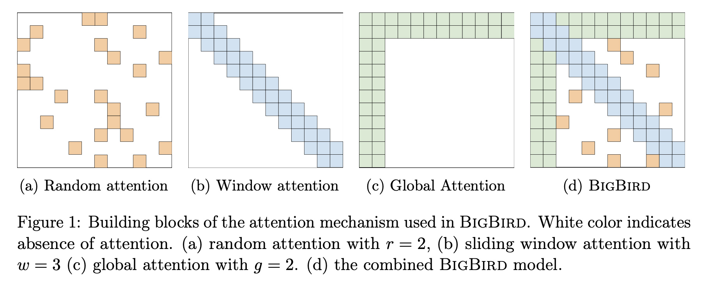

# NLP

Initially, the NLP or Computational Linguistics field was focused on applying the generative grammar approach described 
by [Noam Chomsky](people.md#noam_comsky) in [the mid 60s](https://en.wikipedia.org/wiki/Generative_grammar).
However, the results of applying that approach was never impressive.

Since then, other approachs like tagging Part of Speech (PoS) in sentences and applying statistical techniques have been
demostrated to be more successful in the NLP field. As it's usually described in any other modern ML field, the successful
application of these techniques has been only possible due to the increase in computing power and the tagging and recollection
of big datasets that have occurred in the last coupule of decades.

Nowadays, in the start of the third decade of the XXI century, the so called language models are predominant and applied 
in many of the problems related to NLP. 
   
## Frameworks

* [Huggingface](https://huggingface.co/) The de-facto standard framework for modern NLP.
* [X-Transformers](https://github.com/lucidrains/x-transformers) A new repo, implementing also the later
 advances in the spectrum of Transformer-based models.
* [NLP Architect](https://github.com/NervanaSystems/nlp-architect)

## Websites, Blogs & Repos

* [Papers with Code](https://paperswithcode.com/)
* [NLP Progress](http://nlpprogress.com/)
* [NLP Bootcamp](https://github.com/neubig/lowresource-nlp-bootcamp-2020) CMU lectures on NLP by visitors to the
 Language Technologies Institute.

# NLP Topics

## Text Categorization

One of the classical problems in NLP.

**Goal**: Assign labels/tags to text examples (e.g. sentences, paragraphs, documents...)
**Options for doing text annotation**:
- Manual - Reliess on humnans; Because of that fact this approachss doesn't scale, is costly, and error prone.
- Automatic - The current trend due to the increasingly amount of text examples required for many applications in the
industry.
  - Rule-based methods
    - Use a set of predefined rules
    - Require domain knowledge from experts
  - ML-driven methods
    - Use a set of prelabeled examples to train models.
    - Learn -during a training phase- based on observations of data contrasted against the true/gold labels already
    tagged by domain experts for a certain number of the so-called train examples.
    - The final model obtained with this method has learned associations between the text and the labels

We will focus on this approach only, and mainly on the ML-driven methods.

__Applications__:
1. Sentiment analysis
2. News classification
3. Content moderation
4. Spam filtering
5. Question-answering
6. Natural language inference
...

### Procedure

The traditional way of doing text classification consists of these steps:

0. **Dataset creation** - Create (or download, if a well-know industry used dataset is considered to be used) at least
 two datasets from the text examples available: train and test. See [Datasets](datasets.md) section for more information.
1. **Preprocessing** - Some handcrafted [features](vocabulary.md#feature) are [extracted](vocabulary.md#feature
-engineering) from the train and test datasets. This may require also to do some transformations on the raw input data.
2. **Training** - From each train example, use the features extracted + its associated label, as input to train a model
 that will
learn associations from the features and the labels to make predictions on new input features.
3. **Testing** - Feed a model with the features extracted from each test example to the train model to obtain a
 prediction.
4. **Evaluation** - Take each prediction obtained and contrast it with the corresponding true/gold label for test
 examples and calculate the required [metrics](metrics.md) for the classification problem at hand.

Popular Algorithms used for text classification are [Naive Bayes](algorithms_and_model_architectures.md#naive-bayes),
[SVMs](algorithms_and_model_architectures.md#support-vector-machines), [HMMs](algorithms_and_model_architectures.md#hidden-markov-models),
[GBTs](algorithms_and_model_architectures.md#gradient-boosting-trees) and [random forests
](algorithms_and_model_architectures.md#random-forests)

## Entity Recognition

## Question-Answering

# NLP Architectures

## Recent Origins

These papers influenced a paradigm shift towards what will be called [Deep Learning](vocabulary.md#deep-learning
), which will imply the massive adoption of neural networks for ML tasks.

### Word2Vec

"Efficient Estimation of Word Representations in Vector Space" {{ #cite mikolov_efficient_2013 }} and "Distributed 
Representations of Words and Phrases and their Compositionality" {{ #cite mikolov_distributed_2013 }} or simply the
 Word2Vec papers by Mikolov et al. at Google marked a paradigm shift in NLP, as it showed the potential of an embedding
 model trained in large amounts of data (1.6 Billion data words). In particular, they showed the quality of the 
representations obtained after training by using a word similarity task.
A deeper explanation can be found in "word2vec Explained: deriving Mikolov et al.'s negative-sampling word-embedding
 method" {{ cite goldbert_word2vec_2014 }}

[Google Source code](https://code.google.com/archive/p/word2vec/) 
[Source code](https://github.com/tmikolov/word2vec)

The following is an amazing explanation of the W2V paper: [Illustrated Word2Vec](https://jalammar.github.io/illustrated-word2vec/)

### Glove

Problem with Word Embeddings is that the representations that are spit out of them, despite they are powerful (e.g. 
you can do vector arithmetic with them), they are very shallow; shallow in the sense that only the first layer
 (called the embedding layer) has seen all the huge corpus where where the vector representations were trained on. The
rest of the layers of the potentially deep NN model (e.g. LSTM or GRU) will be trained only on a (probably) way small
 dataset for the application at hand.
 
So, why not pretrain more layers in order to learn grammar, disambiguate words based on context, etc.? This question
lead to the development of the so called [Language Models](vocabulary.md#language-model).

### Elmo

"Deep contextualized word representations" {{ cite peters_deep_2018 }} a.k.a. the "Elmo" paper, improved the results
obtained by Word2Vec. The main difference is that Elmo adds context to word representations. Word vectors are
learned functions of the internal states of a deep bidirectional language model (biLM), pre-trained also on a large
text corpus. Essentially the model architecture is a stacked LSTM. This marked the start of the "Sesame Street Saga".

[Slides](https://www.slideshare.net/shuntaroy/a-review-of-deep-contextualized-word-representations-peters-2018)

### ULMFit

A 2018 LM from [Jeremy Howard](people.md#jeremy-howard) and other [fast.ai](http://fast.ai/) guys.

## Attention

This was a game changer paper when it appeared in 2017 {{ cite vaswani_attention_2017 }}.
The concept of attention is taken, as many others, from cognitive sciences (e.g. psycology, neuroscience, education.) It 
describes the process of focusing on certain concrete stimulus/stimuli while ignoring the rest of stimuli in an 
environment. In the case of NLP for example, the context/environment can be a sentence and the stimulus a word.
  
* [Attention and Memory-Augmented Networks for Dual-View Sequential Learning (KDD 2020)]()

Encoder Components:

1. (Masked) Self-Attention

Input: Sequence of tensors (e.g. representing words in a sentence)
Output: Sequence of tensors; each one is a weighted sum of the input sequence

See [Normalization](vocabulary.md#normalization) for more info on normalization.

2. Positional Encoding

As word order is an important factor in LMs, Transformers combine word embeddings with position embeddings in its
 input. This encoding will take into account the order of words when doing the computations. 

3. Layer Normalization

More resources on Transformers:

[Peter Bloem's Blog Entry](http://peterbloem.nl/blog/transformers)

Apart from the attention mechanism, in there's been some recent research focus on how changing the attention layer
 [for a FFT](https://medium.com/syncedreview/google-replaces-bert-self-attention-with-fourier-transform-92-accuracy-7-times-faster-on-gpus-7a78e3e4ac0e)
can sped up the Transformer encoder architectures {{ #cite leethorp_fnet_2021 }}. 

#### Sparse Transformers

* [Sparse Tansformer](refs.md#sparse) Self-attention complexity from O(n2) to O(n*sqrt(n)).
* [Reformer](refs.md#reformer) Self-attention complexity O(L2) to O(LlogL), where L is the length of the sequence.
* [Linformer](refs.md#linformer) Self-attention complexity from O(n2) to O(n) in both time and space.

## Transformers

Despite the Transformers architecture is very popular, it still has its drawbacks; for example it is
 expensive to use with long sequences, e.g. with n > 512. This makes this kind of models limited for certain NLP
  tasks such as QA or summarization. More recent models such as Longformer, Performer, Reformer
 , or Clustered attention have tried to address this problem by approximating the otherwise potentially huge attention
  matrix. Out of those models, [BigBird](#big-bird) seems to be the one that has achieve this goal more
   effectively.
   
### Sesame Street Saga

The [ELMO](#elmo) paper started a trend to name many NLP model architectures and variations after the characters of
Sesame Street/Muppets. Some refer to this fenomenon as ["Muppetware"](https://www.theverge.com/2019/12/11/20993407/ai-language-models-muppets-sesame-street-muppetware-elmo-bert-ernie)
These are the most relevant ones.  

TODO mention at least ~~ELMo,~~ BERT, Grover, Big BIRD, Rosita, RoBERTa, ERNIEs, and KERMIT. 

#### BERT

By 2018 Google developed what is still as of 2021, the SotA of embedding-based models for the majority of the industry.
Based on the Transformer architecture, it was trained on 3.3 billion words. Comming in two different flavours, base
 and large, they mainly differ on the number of parameters.
 
BERT {{ #cite devlin_bert_2019 }} has become the de-facto reference model for NLP since 2018.

#### RoBERTa {{ #cite liu_roberta_2019 }}
Replication study of BERT pretraining that measures the impact of many key hyperparameters (Bigger Batch size and LR) and training data size (10X).
It shows improvements on most of the SotA results by BERT and followers. Questions the results of some post-BERT models.
It uses a single sentence for the document-level input like SpanBERT.

[Original Code](https://github.com/pytorch/fairseq)

#### [SpanBERT](https://arxiv.org/pdf/1907.10529.pdf)
 Masks spans of words instead of random subwords. Spans of words refers to global entities or loca/domain-specific meaning (e.g. American Football)
 Span Boundary Objective(SBO) predicts the span context from boundary token representations. Uses single sentence document-level inputs instead of
 the two sentences in BERT.
 
 [Original Code](https://github.com/facebookresearch/SpanBERT)

#### Reformer

The main advantage of this model is that provides an attention mechanism for long sequences with O(Nlog(N))

#### Performer

#### Big Bird

The main questions according the authors of Big Bird that the paper addresses successfully are:
- "Can we achieve the empirical benefits of a fully quadratic self-attention scheme using fewer inner-products?"
- "Do these sparse attention mechanisms preserve the expressivity and flexibility of the original network?"

This model {{ #cite zaheer_big_2020 }} relies on what the authors call block sparse attention instead of the regular
O(N^2) attention mechanism. The attention in Big Bird is summarized in the following picture:

##### Small Models/Small Devices
* [Lite transformer with Long-Short Range Attention](refs.md#lite)
Uses Long-Short Range Attention (LSRA) in which a group of heads specializes in
the local context (using convolution) and another group specializes in the
long-distance relationships (ussing the attention mechanism.) Focus on edge (mobile) devices.

  
Small Models

 * [Distilbert](https://arxiv.org/abs/1910.01108)
 Check it out in https://huggingface.co/

  
Other Sesame Street Papers

 * [FinBERT](https://arxiv.org/abs/1908.10063) Bert applied to Financial Sentiment Analysis.
 Code: https://github.com/ProsusAI/finBERT]
 * [FinBERT](refs.md#abcd)

### Non-Sesame Street Environment

** [Turing NLG](https://www.microsoft.com/en-us/research/blog/turing-nlg-a-17-billion-parameter-language-model-by-microsoft/)
"Turing Natural Language Generation (T-NLG) is a 17 billion parameter language model by Microsoft that outperforms the state of the art on many downstream NLP
tasks. We present a demo of the model, including its freeform generation, question answering, and summarization capabilities, to academics for feedback and
research purposes. <|endoftext|>" - Summary generated by itself.

## GPT Family

Generative Pre-trained Transformer.
In the same way as [ELMO](#elmo) and [UMLFit](#umlfit) learns to predict the next word in a sentence. The main
 difference with those two is that GPT, as BERT, uses an embedding layer and transformer layers instead of LSTMs.
It uses masked self-attention as it conditions only on preceding words.

GPT-2 was trained on 8M Web pages and comes in different sizes. It was considered at that time (2019) "too 
dangerous" to be publicly available. One of the tasks it was able to perform relatively well was the 
[Winograd](people.md#winograd) Schema challenge for common sense reasoning, and in particular, pronoun dissambiguation.

[Talk to Transformer (Now inferkit)](https://app.inferkit.com/demo)

### GPT-3

175 Billion parameters, several thousands of GPUs to train and more than a month of training.
Weights weren't released due to concerns in potential misuses. There's a global effort by [EleutherAI](https://www.eleuther.ai/) to make the
 training and publish the weights open sourced.

## T5

Text-To-Text Transfer Transformer, hence T5 {{ #cite raffel_exploring_2020 }}. And because of the Text-To-Text part
, input is a string and output is too.

Some of the figures are impressive:
- Released on early 2020
- Trained on C4 corpus (100x bigger than Wikipedia)
- 11 Billion params
- SotA in GLUE, SuperGlue and SQuAD

Google Switch Transformer, has 1.6 Trillion parameters. 

### Lifelong learning in NLP

* <a name="biesialska">[Continual Lifelong Learning in Natural Language Processing: A Survey](https://www.aclweb.org/anthology/2020.coling-main.574.pdf) Colling, 2020</a>

### Few-Shot Learning in NLP

[FSL](vocabulary.md#few-shot-learning) in NLP has been used successfully in applications like parsing translation
, sentence completion, sentiment classification from reviews, user intent classification for dialog systems, 
criminal charge prediction, word similarity tasks such as nonce definition, and multi-label text classification.
Recently, a new relation classification data set called FewRel [52] is released. 

This compensates for the lack of benchmark data set for FSL tasks in natural language processing.

## Text Generation

Data-to-Text Generation (DTG) or simpy, text generation is a subfield of NLP which pursues the automatic generation of
 human-readable text using computational linguistics and AI.
 
Approaches to text generation use a [language model (LM)](vocabulary.md#language-model) to generate the probability
 distribution from we can sample to generate the next token in a sentence.
 
In the last few years, one of the most used generative models is the so-called Recurrent Neural Networks (RNN) that
 have been used successfully also for other NLP task such as classification. 

However, LMs per-se, despite promising for text generation, are limited in the control terms that humans
 have for "influencing" the generated content. The problem relies on the fact that, once the models are trained
 , it becomes difficult add control attributes without modifying the architecture to allow extra input
attributes or tuning with extra data. The prompts written by humans or generated automatically act just a starting
cue for the generator, but does not allow to control other properties such as define the topic of the generated
 text.
 
Without these control attributes, models tend to ["hallucinate"](vocabulary.md#hallucination).
More recent approaches to text generation include these control mechanism: CTRL {{ #cite shirish_ctrl_2019 }} and PPLM
 {{ #cite dathathri_plug_2020 }}.

[Conditional Transformer Language (CTRL)](https://github.com/salesforce/ctrl) introduces control codes to condition the
 language model. These control
 codes govern
 the style, content, and task-specific
behavior of the generated text. More specifically, the control codes allow 1) preserve the advantages of unsupervise
 learning; 2) seamless
 integration in the structure of the raw while providing the required control over generation, and 3) predict which
  parts  of the training data are most likely given a sequence.

CTRL is trained on control codes that co-occur narurally with the original text typically used for training LMs.
Big datasets such Wikipedia are assigned with a domain-related control code; other smaller datasets (e.g. content from
specific online communities in Reddit are assigned to a broader domain name (Reddit) and with subdomain information
 (e.g. r/politics.) All control codes can be traced to a particular subset of the training data.
Moreover, the codes can be combined with codes during generation to cross-over task-specific and domain/content
 behaviors.
 
As CTRL, Plug and Play Language Model (PPLM) combines a pretrained LM with n "attribute classifiers" which allow to
 drive the text generation process externally without architectural changes. This work was influenced by the
Plug & Play Generative Networks (PPGN) work in computer vision (2017). In PPGN a discriminator (attribute model)
 \[ p(a|x) \] is plugged with a generative model p(x), so that sampling from the resulting \[ p(x|a) \propto p(a|x
 )p(x) \], effectively creates a generative model conditioned from the provided attribute a.
As the attribute is plugged post facto in the activation space, no further fine-tuning is required.

Another recent work is {{ cite rebuffel_controlling_2021 }}, based on RNNs. This work addresses hallucination by
 treating it at a
 word level, which is a more fine-grained approach than other works, which deal with hallucination at the instance
 level. It proposes a procedure that consist of: 1) a word-level labeling procedure built on dependency parsing and
  based on co-ocurrences and sentence structure; 2) a weighted multi-branch decoder which, guided by the alignment
labels from the previous step, will used them as word-level control factors. At a training time, the decoder
 will learn generating descriptions without being misled by un-factual reference information. This is due to
 the fact that the model will be able to distinguish between aligned and unaligned words.
 
 
## Evaluation

In NLP, there are many different tasks that can be evaluated to test different aspects of the language. Some of
 them are:
 
* Named Entity Recognition (NER): identify the different entities out of the words of a text: e.g. which words are a
 proper name of a person or an organization.
* Textual Entailment: when 2 sentences are provided to the LM, the first one entails or contradicts the other?
* Coreference Resolution: when a pronoun appears in a text (e.g. “it”) that may possibly refer to multiple objects, try
 to dissambiguate which object the pronoun refers to.

The following are some of the main benchmarks used in NLP around this time (2021).

### SQuAD
* Original paper: {{ #cite rajpurkar_squad_2016 }}
* Task: Question answering
* Details: 
  * 100K question-answer pairs with the answer included in the question
* Example: 

"In meteorology, precipitation is any product
of the condensation of atmospheric water vapor
that falls under gravity. The main forms of precipitation include drizzle, rain, sleet, snow, graupel and hail... 
Precipitation forms as smaller
droplets coalesce via collision with other rain
drops or ice crystals within a cloud. Short, intense periods of rain in scattered locations are
called “showers”.

What causes precipitation to fall?
gravity"
* [Blog Entry about SQuAD](https://towardsdatascience.com/the-quick-guide-to-squad-cae08047ebee)

### SNLI

* Original paper: {{ #cite bowman_large_2015 }}
* Task: Natural Language Inference
* Details: 
  * Output the relationship between a piece of text and a hypothesis.
  * 570K pairs
* Example:

"A black race car starts up in front of a crowd of people.

contradiction
C C C C C

A man is driving down a lonely road"

### GLUE

* Original Paper: {{ #cite wang_glue_2019 }}
* Task: 9 tasks
  * Is sentence grammatical or not
  * Sentiment analysis (+,-,=)
  * Sentence B paraphrase of A?
  * Sentence similarity
  * Two questions similar?
  * Sentence Entailment
  * Entailment or contradiction?
  * B contains answer of question A?
  * Correct/incorrect referents (pronoums)?
* Details:
  * [Blog Entry](https://mccormickml.com/2019/11/05/GLUE/)
  
  
### SuperGLUE

TODO