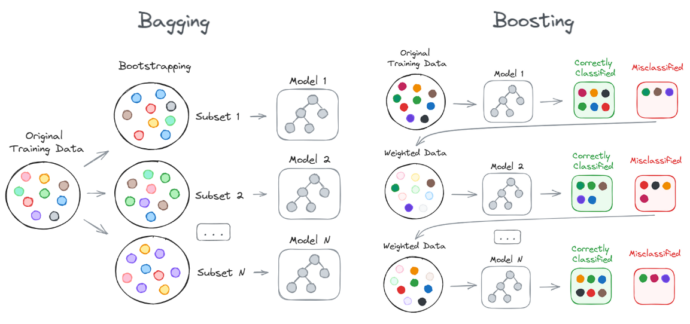

# Machine/Deep Learning Topics

## (Artificial) General Inteligence

This has been, is, and will be for some more time at least, the dream of scientist/researchers/engineers in the field of artificial intelligence.

In short, achieving a general artificial intelligence assumes the ability of an agent to learn new tasks whilst maintaining a general capability on fulfilling previous learned tasks.

This artificial general intelligence requires that the agent does not forget what it has learn -what is called [catastrophic forgetting](#catastrophic_forgetting)

in the literature- and assumes that the agent will continue learning new tasks -called [continual or lifelong learning](#continual-learning).

Since the advent of ChatGPT on November 30th of 2022, there's been a lot of hype about this.

## Loss Function

### Mean Squared Error (MSE)

MSE measures the average squared difference between the actual values and the predicted values, penalizing larger errors more significantly due to the squaring of the differences.

$$
\text{MSE} = \frac{1}{n} \sum_{i=1}^{n} (y_i - \hat{y}_i)^2
$$

- $n$ is the number of data points.
- $y_i$ is the true value for the $i$ th data point.
- $\hat{y}_i$ is the predicted value for the $i$ th data point.

**Advantages**: Easy to compute and differentiate. It is suitable for regression problems where the goal is to minimize the squared difference between predicted and actual values.

**Disadvantages**: Sensitive to outliers, as large errors are squared, potentially leading to  overemphasis on outliers.

### Cross-Entropy Loss

Cross-entropy loss measures the performance of a classification model whose output is a probability value between 0 and 1. It increases as the predicted probability diverges from the actual label.

The formula for cross-entropy loss, often used in classification tasks, particularly with softmax output in neural networks, is given by:

For binary classification:

$$
\text{Cross-Entropy Loss} = - \left[ y \cdot \log(p) + (1 - y) \cdot \log(1 - p) \right]
$$

For multi-class classification:

$$
\text{Cross-Entropy Loss} = - \sum_{i=1}^{C} y_i \cdot \log(p_i)
$$

- $y$ (in binary classification) is the true label, either 0 or 1.
- $p$ is the predicted probability of the positive class.
- $y_i$ (in multi-class classification) is a binary indicator (0 or 1) if class $i$ is the correct classification.
- $p_i$ is the predicted probability of class $i$.
- $C$ is the total number of classes.

**Advantages**: Ideal for classification problems, particularly binary and multi-class classification. It measures the performance of a classification model whose output is a probability value between 0 and 1.

**Disadvantages**: Can be sensitive to class imbalance and may lead to slower convergence in some cases.

### Hinge Loss

The hinge loss penalizes predictions that are on the wrong side of the decision boundary or too close to it. For a correct prediction with a margin greater than 1, the hinge loss is zero; otherwise, the loss increases linearly as the prediction moves further away from the correct classification.

$$
\text{Hinge Loss} = \max(0, 1 - y \cdot f(x))
$$

- $y$ is the true label of the data point, which is typically either +1 or -1.
- $f(x)$ is the predicted value (or the decision function output) for the input $x$.

**Advantages**: Commonly used with Support Vector Machines (SVMs) for classification tasks. It encourages correct classification with a margin.

**Disadvantages**: Not suitable for regression tasks. It can be sensitive to the choice of the margin.

#### Papers

- [Retrospective Loss: Looking Back to Improve Training of Deep Neural Networks (KDD 2020)](https://arxiv.org/abs/2006.13593)
Learns from prior training experiences in the form of DNN model states during to guide weight updates and improve DNN
training performance. The retrospective loss seeks to ensure that the predictions at a particular training step are more
similar to the ground truth than to the predictions from a previous training step (which has relatively
poorer performance). As training proceeds, minimizing this loss along with the task-specific loss, encourages the
network parameters to move towards the optimal parameter state by pushing the training into tighter spaces around the
optimum. Claims implementation is 3 lines of Pytorch code. Interesting paper

## Transfer Learning

Recent success of DL has been produced, among other reasons, for the big amount of labeled training data.
However, in general, this is not the approach to follow for AI solving different tasks.
Humans are good at learning from very few examples, so scientifically there's still "something" we still need to understand.

Approach of modern Transfer-Learning:

1. Pre-train in large genral corpus, usually unsupervised (e.g. as in BERT)
1. Fine-Tunning on specific tasks with smaller (supervised) training sets.

Approach of Hierarchical-Multilevel Classification:

- [Hierarchical Transfer Learning for Multi-label Text Classification (ACL 2019)](https://www.aclweb.org/anthology/P19-1633/)
- [Multi-Source Deep Domain Adaptation with Weak Supervision for Time-Series Sensor Data (KDD 2020)](https://arxiv.org/abs/2005.10996)
Interesting

### Surveys

- [HuggingFace Presentation on Transfer Learning](https://docs.google.com/presentation/d/1fIhGikFPnb7G5kr58OvYC3GN4io7MznnM0aAgadvJfc/edit?ts=5c8d09e7#slide=id.g5888218f39_364_0)
- 2010 [A Survey on Transfer Learning](https://www.cse.ust.hk/~qyang/Docs/2009/tkde_transfer_learning.pdf)
- 2018 [A Survey on Deep Transfer Learning](https://arxiv.org/abs/1808.01974)
- 2020 [A Survey on Transfer Learning in Natural Language Processing](https://arxiv.org/abs/2007.04239)

### Few-shot Learning (Meta-learning)

Meta-learning aims to train a general model in several learning tasks. The goal is that the resulting model has to be able to solve unseen tasks by using just
a few training examples.

Concept of [shortcut learning]: You don't learn a task by completely understanding it but by taking "shortcuts" imitating.
e.g. when training on some math exercises in highschool because every year they had the same structure.

- [Shortcut Learning in Deep Neural Networks](https://arxiv.org/abs/2004.07780)

Meta-Learning -learning (how) to learn-: Find an algorithm  that from a small input data (few-shot examples)  can predict the output  of a new input

- Prototypical Networks [Prototypical Networks for Few-shot Learning]()
Nearest centroid classification

- MAML [Model-Agnostic Meta-Learning for Fast Adaptation of Deep Networks]()
Model-agnostic meta-learning algorithm compatible with any model trained with GD and applicable to a variety of different learning problems, including
classification, regression, and reinforcement learning.

- [Selecting Relevant Features from a Multi-Domain Representation for Few-shot Learning]()

Work from Hugo Larochelle at Google Brain:

- [Meta-Dataset: A Dataset of Datasets for Learning to Learn from Few Examples]()
- [A Universal Representation Transformer Layer for Few-shot Image Classification]()

## Calibration

A measure of the confidence of the predictions of a model. Concept comes from weather forecast.

Main Methods:

- Platt Scaling
- Matrix Vector Scaling
- Temperature scaling

Papers:

- [On Calibration of Modern Neural Networks (ICML 2017)](https://arxiv.org/abs/1706.04599)
- [Beyond temperature scaling: Obtaining well-calibrated multiclass probabilities with Dirichlet calibration (NeurIPS 2019)](https://papers.nips.cc/paper/9397-beyond-temperature-scaling-obtaining-well-calibrated-multi-class-probabilities-with-dirichlet-calibration.pdf)

  
Blogs

 * [How and When to Use a Calibrated Classification Model with scikit-learn](https://machinelearningmastery.com/calibrated-classification-model-in-scikit-learn/)
 * [Prediction & Calibration Techniques to Optimize Performance of Machine Learning Models](https://towardsdatascience.com/calibration-techniques-of-machine-learning-models-d4f1a9c7a9cf)
 * [Calibration in Machine Learning](https://medium.com/analytics-vidhya/calibration-in-machine-learning-e7972ac93555#:~:text=In%20this%20blog%20we%20will%20learn%20what%20is%20calibration%20and,when%20we%20should%20use%20it.&text=We%20calibrate%20our%20model%20when,output%20given%20by%20a%20system.)
 * [Calibration Tutorial (KDD 2020)](http://kdd2020.nplan.io/presentation) [Github](https://github.com/nplan-io/kdd2020-calibration)

  
Videos

 * [Calibration Tutorial](https://www.youtube.com/watch?v=rhnqZV6eKlg&feature=youtu.be)

## Causality

- [The Book of Why (Judea Perl)](http://bayes.cs.ucla.edu/WHY/)
- [Causal Inference Intro with Exercises](https://github.com/DataForScience/CausalInference)
- [Invariant Risk Minimization](https://arxiv.org/abs/1907.02893)
Learning paradigm to estimate invariant correlations across multiple training distributions. IRM learns a data representation such that the optimal classifier,
on top of that data representation, matches for all training distributions.

## Continual Learning and Catastrophic Forgetting

In biology, *Continual Learning* refers to the process of continually gather, update, and transfer skills/knowledge throughout life (lifespan).

In ML, it is still a major research problem to solve the fact that neural networks use to catastrophically forget previously learned tasks when they are trained in new ones. This fact it is the main obstacle that prevents the equivalent of continual learning to be implemented in the field of artificial neural networks.

[This is a summary of the recent (2021) advances in continual learning in NLP.](https://www.aclweb.org/anthology/2020.coling-main.574.pdf)

[Sejnowski](people.md#terrence-sejnowsky) et al. {{ cite tsuda_modeling_2020 }} have developed a NN
 architecture that shows how
 hierarchical gating supports adaptive learning while preserving memories from prior experience.
They show also how when introducing damages in the model, it recapitulates disorders found on the
 human Prefrontal Cortex.

### Protocols/Strategies for Solving Catastrophic Forgetting (CF)

One problem with all the different strategies proposed for solving CF is that the field lacks a framework for comparing the effectiveness of the techniques. This has been addressed by studies like [vandeven2019](refs.md#vandeven2019) and [vandeven2019b](refs.md#vandeven2019b).

The approaches to solve Catastrophic Forgetting can be classified in:

#### Regularization Approaches

<https://arxiv.org/pdf/1612.00796.pdf>

#### Generative Replay

- [Continual Lifelong Learning with Neural Networks:A Review](refs.md#parisi2020)
- [Brain-inspired replay for continual learning with artificial neural networks (Nature, 2020)](https://www.nature.com/articles/s41467-020-17866-2.epdf?sharing_token=bkJqxr4qptypBkYehsw_FtRgN0jAjWel9jnR3ZoTv0NoUJpE84DVnSx_jyG1N8KQimOuCCtJtaDabIpjOWE47UccZTsgeeOekV8ng2BR-omuTPXahD4aCOiCIIfIO2IOB-qJOABLKf7BlAYsTBE8rCeZYZcKd0yuWJjlzAEc1G8%3D)
- [Generative replay with feedback connections as a general strategy for continual learning (ICLR2019)](https://arxiv.org/pdf/1809.10635v2.pdf)
- [Three Scenarios for Continual Learning](https://arxiv.org/pdf/1904.07734.pdf)
- [Compositional language continual learning](https://openreview.net/pdf?id=rklnDgHtDS)

# GANs and Creativity

# Research Topics

Unsupervised Learning

Reinforcement Learning

- Unsupervised RL
- Meta-Reinforcement Learning

# Personalization

## Problems

Model <-> User interaction

- In general a model recommends items, and user actions based on those recomendations are used as training data for improving the model.
- Missrepresentation of New items - a group that suffers from algorithmic bias.
- It's interesting to study how recommendation feedback loops disproportionally hurt users with minority preferences
- Features:
  - Empiric (CTR)
  - User history

### Cold start

- Can be looked as a fairness problems
- Metrics should be tailored to use cases
- Fairness methods as a solution.
- Fairness in new advertisers: measure the severity of the advertiser cold start using fairness metrics and use
  fairness methods to mitigate it.

Individual fairness -> Similar individuals should be treated similar by the algo
Group fairness -> Individuals from the protected group should get similar treatment as individuals without the protected
attribute. Protected attribute, gender, race...

Methods: Balance for positive class and Calibration

Fairness correction techniques:

- Preprocessing: Correct the training data
- inprocessing: Penalty term to the loss function
- postprocessing: Apply corrections

Address multi-side fairness: Satisfy constraints of all stakeholders (e.g. old/new advertisers). We take the side of the
new items.

Fairness in Ranking

Small changes in scores can lead to large changes in exposure
Static fairness constraints may cause harm in fairness over time
Decomposition of fairness in complex systems: Candidate Generation -> Engagement A model, Engagement B model...

- Fairness doesn't necessarily decompose

Faire recommendations with Biased Data (Thorsten Joachims)
History of ranking dates back to the 1960 for finding books in a library
In 1994 with search engines that moved to finding everything
   Maximize the utility of the rankings for the users
In 2020, still we look for Maximize the utility of the rankings. But there are two sides for the utility: 1) for the users (buyers, listeners, readers) but also for the items 2)
(sellers, artists, writers), etc.! That is the variety of use cases is more diverse

However utility maximization it may not be fair for many candidates, specially if the probability of the top candidates it's very close together

Fairness: If two items has similar merits, their exposure should be the same. There are endogenous and exogenous factors:
Fairness of exposure: Endogenous (merit), Exogenous (biases)

# Recommendation feedback loops disproportionally hurt users with minority preferences

- Called "Algorithmic confounding". Perspective
   Users:
  - "I don't get whwat I'm looking for"
  - "This sistem sucks"
   Company:
  - User segmentation
   Technical:
  - Bad training and evaluation protocols

Recommendation feedback:

- Provokes homogeneization of user behaviour
- Users experience losses in utility
- Amplifies the impact of the rec system on the distribution of the item consumption

Initial data may not be enough
Poorly tuned models hurt user with minority preferences recommending items further from their preferences
A/B test can weaken overall performance. Too many of them can delay recommending the most relevant items.

Matrix factorization

## Causal modeling applied to messaging at Netflix

# Conversational Recommmendation with Natural Language

We want:

- Speaking the user language is essential for a conversational recommendation
- Model that understands natural requests: "I'd like to watch something relaxing"

Soft attribbutes: Property of an item that

- is not a verifiable fact
- can be universally agreed on
- meaningful to compare
- we can say that one is great than the other

Answers to questions

- Polar yes/no question
  - Direct answer
  - Indirect answer (e.g. for being polite). Can include more information. - Do you have kids? - I have 2 daughers
Richness of language

Explainable User Models (Why?)

- What does the system know about me
- How does the system interprets that
- How does it go from user model to recommendations

Observing the language of the user requires new approaches for data collection and models.

## Ensemble Methods (a.k.a. Ensemble Learning)

Ensemble methods (or ensemble learning) are a powerful technique in ML where multiple models are combined to create more robust and accurate predictive models. These aggregated modes are often referred to as “weak learners.” The idea behind this technique is that, by combining the predictions of several models, the resulting model (or ensemble of models) can reduce errors, improve generalization, and achieve better performance than any individual model could (Applying the holistic view that the sum is greater than the parts.)

### Rationale of Ensemble Methods

As we mention above, the holistic approach of this technique regarding model training may be attribute to the  success of ensemble methods. The ability to leverage the diversity of the base models, where each model may capture different aspects of the data, and finally combine their results, can mitigate the weaknesses of each individual models (hence the name of weak models). Their effectiveness can be summarized in these points:

- **Variance Reduction:** As we showed above, bagging can reduce the variance of the model by averaging out the predictions of different models trained on different subsets of data.
- **Bias Reduction:** Boosting techniques reduce bias by focusing on the errors of previous models, iteratively improving the model.
- **Improved Generalization:** Often generalize better to unseen data than single "weak models" because they combine multiple perspectives.
- **Robustness:** By combining multiple models, ensembles are less prone to be influenced by outliers/noisy data.

### Challenges of Ensemble Methods

- **Increased Complexity:** Having multiple models increases the managing complexity of the training and inference processes.
- **Computational Cost:** Training and using multiple models require more computational resources.
- **Interpretability:** Compared to a single model, it is harder to interpret the decision-making process of an ensemble.

### Basic Ensembles

1. **Mean/Average:**
   - Predictions from multiple models are averaged to produce the final result.
      - Regression: Take the arithmetic mean of the predicted values.
      - Classification: The predicted probabilities of each class are be averaged; the class with the highest average probability is chosen. **Majority voting** can be used too as a technique.
   - **Advantage:** Very simple to implement can reduce the variance in predictions, especially if the individual models are uncorrelated.
   - **Limitation:** Assumes that the "weak models" contribute equally to the final prediction, which might not be ideal if some models perform significantly better than others.

2. **Weighted Average:**
   - It assigns different weights to the predictions of each "weak model" based on their performance. Models performing better are given higher weights, while weaker models are assigned lower weights.
   - **Advantage:** Apart from benefitting from the diversity of "weak models", improves performance by leveraging the strengths of each one of them.
   - **Limitation:** Attributing the appropriate weights to each model may be challenging, especially when the models have different strengths over the different dimensions of the dataset.

### Advanced Ensembles

1. **Bagging (Bootstrap Aggregating):**
   - It splits the training data in different subsets and then trains multiple "weak models" over each subset. The goal is to reduce the variance of training a "single model". The subsets are usually generated by randomly, sampling the training data with replacement, a process known as *bootstrapping*. Finally following the ensemble recepy, the predictions from all models are combined to produce the final result.
   - **Advantages:**
     - Reduces overfitting by averaging out the noise present in the individual models.
     - Improves stability and accuracy, especially for high-variance models like decision trees.
   - **Examples:** *Random Forest* algorithm are the most-well known technique of bagging, where multiple decision trees are trained on different bootstrapped subsets.
  
2. **Boosting:**
   - It trains the models in a sequential pipeline/workflow manner, so each "weak model" tries to correct the errors made by the previous models. It aims reducing both bias and variance.
     - Initially, all data points (or *observations*) are given equal weight.
     - After the training of each "weak model", the misclassified observations (or those where errors large) are given more weight; correspondingly, correctly predicted instances get less weight.
     - At the end of the final model predictions, the result is calculated as a weighted sum of the predictions of all models.
   - **Advantages:**
     - Can significantly improve the accuracy of the model by focusing on the errors of previous models.
     - Often leads to superior predictive performance, especially for "weak learners" (e.g., shallow trees).
   - **Limitations:**
     - More prone to overfitting, especially if the boosting process is not properly regularized.
     - Computationally expensive due to its sequential nature.
   - **Examples:** Popular boosting algorithms include *AdaBoost*, *Gradient Boosting*, and *XGBoost*.

### Random Forest vs. XGBoost

Both ensemble methods are powerful tools but, as usual, the choice between them depends on the specific problem, the nature of the data, and the performance requirements. Random Forest is often the go-to method for quick, robust results, while XGBoost is preferred when maximum accuracy is desired, and the additional complexity can be managed.

Let's analyze them in more depth:

#### 1. **Core Concepts**

- **Random Forest (Bagging Method):**
  - It's basically the bagging ensemble method applied to decision trees.
  - It works by creating a large number of decision trees, each trained on a different subset of the training data. These subsets are "bootstrapped" through random sampling with replacement.
  - The final prediction is the aggregate of the predictions of all the trees. For classification, this is typically the mode (majority vote) of the trees, and for regression, it is the mean of the predictions.

- **XGBoost (Boosting Method):**
  - *It's basically the boosting ensemble method applied to decision trees.
  - XGBoost (Extreme Gradient Boosting) is an advanced implementation of gradient boosting. It builds trees sequentially, so each new tree attempts to minimize the errors of the previous ones.
  - The final model is a weighted sum of all the trees, where the contribution of each tree depends on how well it performed.

#### 2. **Model Complexity**

- **Random Forest:**
  - **High Variance Reduction:** Reduces variance by averaging the predictions of multiple trees. This is particularly effective because the trees in a Random Forest are typically deep and fully grown, so they can capture complex patterns in the data.
  - **Independence of Trees:** Each tree in a Random Forest is trained *independently*. This, combined with the random sampling of data and features, ensures that the model is robust and less prone to overfit.

- **XGBoost:**
  - **Bias and Variance Tradeoff:** Focuses on reducing both bias and variance. Because each tree is trained on the residual errors of the previous trees, this approach can be highly accurate but also risk overfitting if not properly regularized.
  - **Sequential Dependency:** Due to the sequential nature of this technique, trees in XGBoost are *NOT independent*;. the final model will be highly tuned to the training data.

#### 3. **Randomness vs. Determinism**

- **Random Forest:**
  - **Randomness:** Introduces randomness both, the bootstraping process (creation of data subsets) and in the feature selection (randomly selecting subsets of features for each split). This helps in creating diverse trees, which -in turn- reduces overfitting.
  - **Parallelism:** Because the trees are trained independently, they can be trained in parallel and thus more computationally efficient.

- **XGBoost:**
  - **Deterministic Learning:** XGBoost is "less random" than Random Forest. Being the model sequentially trained in the end means the outcome is more deterministic and fine-tuned. This also means it can be more prone to overfitting if the model is not carefully regularized as we discussed.
  - **Advanced Optimization:** It uses techniques like gradient boosting,  L1 and L2 regularization, and tree pruning to optimize model performance and prevent overfitting. It can also handle missing data efficiently.

#### 4. **Interpretability and Use Cases**

- **Random Forest:**
  - **Interpretability:** These models are generally easier to interpret than XGBoost. The feature importance can be easily extracted, giving insights into which features are most influential in the model’s predictions.
  - **Use Cases:** They are often preferred when interpretability and robustness are key. It performs well on a wide range of tasks: classification, regression, and when dealing with noisy or high-dimensional data.

- **XGBoost:**
  - **Less Interpretability:** While feature importance can also be extracted from XGBoost, the sequential nature and the use of boosting make the final model more complex and less interpretable compared to Random Forest.
  - **Use Cases:** Particularly useful in scenarios where high predictive accuracy is crucial (e.g. Kaggle competitions) or in domains requiring precise predictions (e.g., finance, healthcare). It is often the go-to method when best performance is key and time/cost benefit is not a problem.

#### 5. **Performance and Overfitting**

- **Random Forest:**
  - **Performance:** Generally very good at handling large datasets and can be highly effective even with minimal hyperparameter tuning; but its performance may plateau (at some point, adding more trees does not necessarily help.)
  - **Overfitting:** Less prone to overfitting compared to other models because the average over multiple trees, especially when there is a lot of noise in the data.

- **XGBoost:**
  - **Performance:** Often outperforms Random Forest in terms of accuracy, particularly on complex datasets where capturing intricate patterns is important; but achieving the best performance usually requires careful hyperparameter tuning.
  - **Overfitting:** It's more prone to overfitting due to its sequential learning process; this can be mitigated with mechanisms like regularization, learning rate adjustment, and early stopping.

#### Random Forest vs. XGBoost Summary

| Feature/Aspect          | **Random Forest (Bagging)**                         | **XGBoost (Boosting)**                          |
|-------------------------|-----------------------------------------------------|-------------------------------------------------|
| **Core Principle**      | Bagging to reduce variance                          | Boosting to reduce bias and variance            |
| **Tree Training**       | Independent, parallel training                      | Sequential, dependent training                  |
| **Randomness**          | High (random sampling of data and features)         | Low (sequential learning with deterministic updates) |
| **Overfitting Risk**    | Lower, due to averaging                             | Higher, but mitigated by regularization and tuning |
| **Interpretability**    | Higher, with straightforward feature importance     | Lower, due to complexity of boosting            |
| **Performance**         | Robust and reliable across many tasks               | Often superior in accuracy, especially with careful tuning |
| **Use Cases**           | General-purpose, interpretable, and robust models   | High-stakes, high-accuracy tasks requiring fine-tuning |
| **Computational Efficiency** | High, with parallel processing possible        | Requires more computational resources, sequential nature limits parallelism |

### Considerations for Practitioners

- **Model Diversity:** The effectiveness of ensembles is very dependend on how diverse are the "weak models". They should make different errors; otherwise the ensemble won’t provide much benefit.
- **Computational Cost:** These methods -particularly boosting- can be computationally expensive and require significantly more resources than single models.
- **Parameter Tuning:** Ensembles often require careful tuning of parameters, such as the number of models in the ensemble, the weights in a weighted average, or the learning rate in boosting.

### Ensemble Methods in Deep Learning

The same rationale and techniques for combining multiple models to improve the system performance seen above can be applied to deep-learning models.

Here are some common ensemble techniques used in deep learning, which are reminiscent of the classical ones:

1. **Averaging:**
   - **Approach:** This is typically used in regression tasks, where the outputs of several models are averaged to produce the final prediction.
   - **Example:** We might average the predictions of several NNs to smooth out predictions and reduce variance.

2. **Voting:**
   - **Approach:** Train several models concurrently, and their predictions are combined using a voting scheme (e.g., majority vote for classification or averaging for regression).
   - **Example:** If for example 3 models predict the class of an image, the class that receives the majority of the votes is the final output.

3. **Bagging (Bootstrap Aggregating):**
   - **Approach:** Train multiple DL models on different subsets of the training data, often with replacement (meaning some data points might be repeated in different subsets).
   - **Example:** A popular implementation is using multiple instances of the same NN architecture but trained on different data subsets.

4. **Boosting:**
   - **Approach:** Train DL models sequentially, each model progressively correcting the mistakes of prior models.
   - **Example:** While less common in DL compared to traditional machine learning, boosting can still be applied, for instance, in cascaded NNs.

5. **Stacking:**
   - **Approach:** Train different models (often using different architectures) independently; then a meta-model (meata-learner) is trained on the outputs (predictions) of these models to make the final prediction.
   - **Example:** Combining convolutional neural networks (CNNs) and recurrent neural networks (RNNs) in a stacked ensemble, with a simple NN or logistic regression model used as the meta-learner.

6. **Snapshot Ensembles:**
   - **Approach:** A single model is trained using a cyclic learning rate; then snapshots of the model at different points during training are used as the ensemble members.
   - **Example:** At training time, the model might is snapshoted several times (e.g. et the end of each epoch), so these saved models could be used together as an ensemble.
