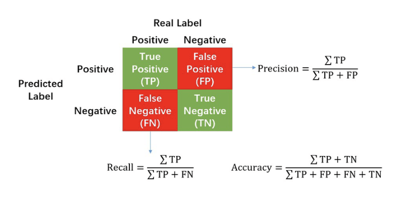
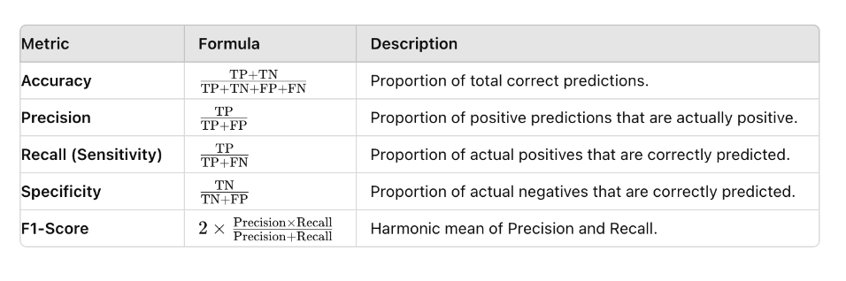
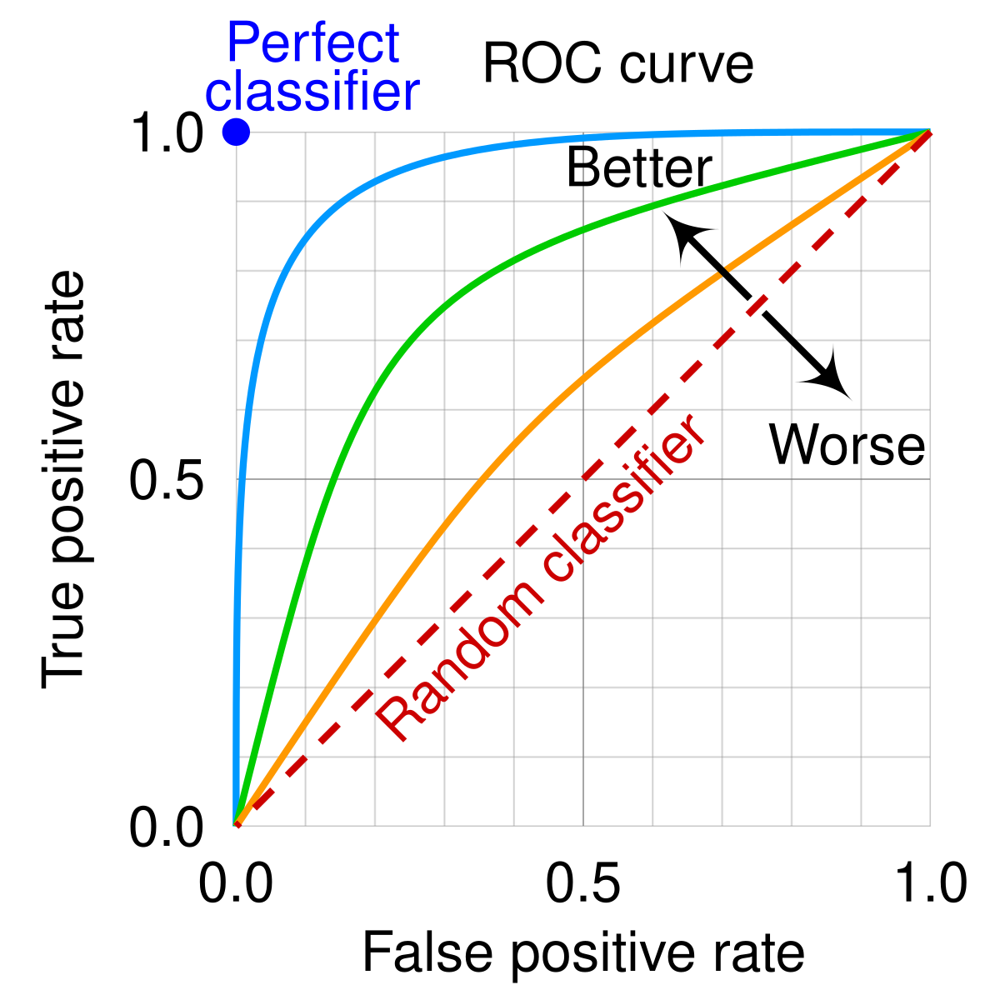

# A

## Auto-Encoder

Autoencoders are unsupervised ANN that can learn data encodings, making the encoder generate those encodings 
specifically for reconstructing its own input (See figure below.) They convert their inputs to encoded vectors that lie
in a latent space that may not be continuous or allow easy interpolation. In the end, this means that regular autoencoders 
are mostly limited to be used to generate compressed representations of their inputs, allowing to regenerate the original
input with minimal loss.

# B

## Backpropagation

A procedure to adjust the weights of a neural network by propagating the error obtained in the forward pass, backwards. 
After calculating the error in the output layer, e.g. by contrasting the output of the forward pass with the known 
so-called gold labels by means of a cost function, the gradient on the input weights of the last layer to the output units 
is calculated; then the weights of that layer are adjusted; this process is repeated backwards layer after layer until 
reaching the input layer. 

# Causality

Correlations is not causation. In ML causality tries to understand the relationships between data in order to create models
that generalize well.

# Chain of Though (CoT)

A prompting method @@cite{Wang et al 2022} that adds to the prompt an optional sequence of examples, each of which shows how to solve the task step-by-step. The aim is to make the model "think" to generate CoTs to solve new tasks. Two approaches can be identified; 1) *Zero-Shot CoT* does not add any prior examples included in the prompt. Proposed in @@cite{Kojima 2022}, a simple prompt is used that basically says: “Let’s think step by step”. The authors claim that in some way the model elicits system-2 thinking @@cite{Kanneman/Tversky} and helps solving tasks requiring slow and multi-step reasoning; 2) *Bag CoT* (or *CoT-BAG*) @@cite{Wang et al., 2023} was proposed for reasoning over graph-related tasks. It basically adds “Let’s construct a graph with the nodes and edges first” to the prompt where the graph is constructed.

# Confusion Matrix

A confusion matrix is a tool used to evaluate the performance of a classification model by comparing the predicted labels to the actual labels. It provides a more detailed analysis of the model's performance than simple accuracy metrics. The confusion matrix is typically presented as a table with four main outcomes:

- True Positive (TP): Correctly predicted positive instances.
- True Negative (TN): Correctly predicted negative instances.
- False Positive (FP): Incorrectly predicted positive instances (Type I error).
- False Negative (FN): Incorrectly predicted negative instances (Type II error).

By examining the values in the confusion matrix, we can calculate various evaluation metrics such as precision, recall, and F1 score, which provide insights into the model's performance for different classes. The confusion matrix is an essential tool for understanding the strengths and weaknesses of a classification model.

Example of a confusion matrix:

Main metrics derived from a confusion matrix:

# E

## Expert System

## [Explainability](vocabulary.md#Interpretability)

[See Interpretability](#Interpretability).

## Explanation

The explicit ability expected in an intelligent agent to give "good" explanations of its decisions to humans. As usual,
the problem here is to define what is a "good" explanation. If we try to mimic in the intelligent agent world, how 
humans proceed giving explanations to other humans, we have to acknowledge we'll have to deal with biases and/or social
expectations. Some researchers argue {{ cite graaf_how_2017 }} that the framework of explanation of those agents will need 
to be consistent with the conceptual framework and psychological mechanisms of human behavior explanation, as humans
will expect explanations falling under those two premises.

# F

## Feature

It's a property extracted from each data instance of a dataset being observed. An example would be the "color" attribute
extracted from row coding an outfit item example from a file called seasonal_outfits.csv). Features are
crucial for many ML procesess. Selecting those features it's an art, which even has a name: [feature engineering](#feature_enginering).
Some of the properties that a good feature should have for being selected are:
- Informative about the concept that they represent
- Discriminating, to be able to separate one example instance from another 
- Independent, if possible from the other features extracted from the data instance

## Feature Engineering

The classical/traditional way of "massage" the input to pass to a ML model (e.g. a classifier.) It refers to the process 
of using domain knowledge to extract features from raw data. This was an "art" in itself usually done by domain experts.
In the age of DL, this has been substituted by the DL models themselves, which represents also the features on top of
 which the learning of a task is done.

## Few-Shot Learning

Humans, and more specifically children, are able to learn how to transfer their experience in similar tasks to a new one
 by using only a small set of examples. For example a kid can learn how to multiply if she already knows how addition
  works and with just a bunch of examples of  multiplications. It's even clearer in the world of images, in
  which once they have learn to recognize a particular human face, children are able to identify the same face in a
  bunch of photographs containing different faces.

In general, up to know, ML algorithms had to be trained in a supervised manner using a large number of examples to
 learn. This is not the best scenario, as this poses many limitations, from the availability of datasets for the
  task at hand to the energy consumption used for training those models. 
  
Few-Shot Learning (FSL) {{ #cite fei-fei_one-shot_2006 }} {{ #cite fink_object_2004 }} are a type of ML problems in
 which a model is trained -in what is called a meta -training phase- on
 different related tasks. This step is supposed to give the model the ability to generalize adequately to unseen related 
supervised tasks using only a few bunch of new input data/examples in the testing/few-shot phase.

How many examples are considered few-shot training? {{ #cite rios_few_2018 }} mentions from 1 to 5.

A recent survey of few shot learning can be found in {{ #cite wang_generalizing_2020 }}.
Different subdomains of FSL can be extrapolated from the regular ML domains such as:
- Few-shot classification
- Few-shot regression
- Few-shot reinforcement learning
- ...

## Fine-Tunning

Fine tuning is a technique to adapt a pre-trained model to a specific task. In order to do so, a regular fine-tuning process usually involves a phase where the training process continues but using a dataset related to the specific task at hand. This process usually requires much less data than the pre-training. In the regular fine-tunning, all model parameters are updated. 

*Transfer learning* -adapt to the new task by updating only certain layers of the pre-trained model- and *Knowledge Distillation* -using a large "teacher" model to "distill" its knowledge representations to a smaller one called a "student" are considered fine-tunning techniques.

# G

## Generalization

The capability of an already trained ML model of adapting to previously unseen data taken from the same distribution as
the data used to train it.

## Generative Adversarial Network (GAN)
A special architecture of ANN aimed to *generate new data* with similar statistics as of the ones found in a particular 
training set. The classical example of what GANs are used for, is the generation of new faces, by interpolating new
features from the data obtained from a pool of preexisting images of faces. The goal is to build the new images as real 
as possible, making them undistinguisable from real images for the human eye.

The idea is to train two models at the same time; the first one is the "generative" one, which serves as the "trend 
gatherer", that is capturing the data distribution; the second one model, called "discriminative", is trained to discern
if a particular sample comes from the training data or from the "generative" moidel {{#cite goodfellow_generative_2014}}

# H

## Hallucination

In text generation tasks, it refers to misleading statements generated by the models when outputing their results
. Usually hallucinations have to do with the quality of the data the model was trained on; for example the

# I

## Interpretability

How well a human can understand the decisions (e.g. the output of a ML classifier) taken by an intelligent system in a given context.
This is related to the extent up to which humans can predict the results of a model. 

### Related

* [Ian Goodfellow Interview](https://www.technologyreview.com/2018/02/21/145289/the-ganfather-the-man-whos-given-machines-the-gift-of-imagination/)

# K

## Kullback-Leibler (KL) divergence

It allows to measure how a probability distribution differs from another. So, it is used to compare two distributions, referred to as the "true" and the "approximation" or "model."

We can think about KL divergence as a way to measure how much information is "lost" when you use the approximation of a distribution instead of the true one:

$$
D_{KL}(P || Q) = \sum_{x} P(x) \log\left(\frac{P(x)}{Q(x)}\right)
$$

- **$P(x)$**: The true distribution of data (e.g. representing real-world data).
- **$Q(x)$**: The approximation of the true distribution.
- **$D_{KL}(P || Q)$**: Measures how much extra information is needed to encode events from $P$ when you're using the distribution $Q$.

If $P$ and $Q$ are identical, the KL divergence is zero, meaning no information is lost. The larger the KL divergence, the more different the two distributions are.

### Properties
0. **Unit-less**: because it measures relative differences between two probability distributions. But the unit of the result depends on the logarithm base used in the calculation; 1) nats if natural logarithm is used. 2) bits if base 2 logarithms are used.
1. **Asymmetry**: $D_{KL}(P || Q) \neq D_{KL}(Q || P)$. The order matters!
2. **Non-negativity**: The KL divergence is always greater than or equal to zero. It’s zero if the two distributions are the same.
3. **Not a distance metric**: As it’s not symmetric, it is not a distance metric, but a measure of relative entropy or difference.

### Example
Imagine you have a coin, and you know the true probability $p$ of heads is 0.5. If someone approximates this probability with $q=0.6$, KL divergence will measure how inefficient that approximation is, in terms of encoding the outcomes of flipping the coin.

KL Divergence Formula:

$D_{\text{KL}}(p \,||\, q) = p \cdot \ln\left(\frac{p}{q}\right) + (1 - p) \cdot \ln\left(\frac{1 - p}{1 - q}\right)$

$p \cdot \ln\left(\frac{p}{q}\right) = 0.5 \cdot \ln\left(\frac{0.5}{0.6}\right) = 0.5 \cdot \ln\left(\frac{5}{6}\right)$

$(1 - p) \cdot \ln\left(\frac{1 - p}{1 - q}\right) = 0.5 \cdot \ln\left(\frac{0.5}{0.4}\right) = 0.5 \cdot \ln\left(\frac{5}{4}\right)$

$D_{\text{KL}}(0.5 \,||\, 0.6) = -0.091 + 0.1115 = 0.0205 \text{ nats}$

# L

# Language Model

In any language, the words (or characters) in a sentence show certain correlations. Those correlations
 capture and contextualize the underlying semantics and characteristics of the particular language. 
 
Sequences of tokens can be found almost anywhere, being the words in a text, pixels in an image, the musical notes in
 a score, etc. A language model could be defined as a statistical model that has learnt to predict the probability of a
 sequence of tokens, capturing the correlation with other nearby tokens, either consecutive or not. In NLP, the tokens 
 use to represent words or n-grams.

The calculation of the next token in the sequence \\( x_n \\) can be modeled as:

\\( p(x_n | x_{n-1}, x_{n-2}...x_{1}) \\)

where \\( x_i \\) represents the ith token in the sequence.

For more information see {{ #cite bengio_neural_2003 }}.

The best language model would be that which could best predict unseen data. To measure the quality of a language model
metrics such as [Perplexity](#perplexity) can be used.

## Loss Function

A loss function is a way to measure how well or poorly a model is performing. It calculates the difference (error) between the model’s predictions (the guess your model is doing based on the input data) and the actual values (the labeled data we have, representing the correct answers).

The smaller the difference, the better the model is doing. The larger the difference, the worse it’s performing.

The goal of training a model is to minimize this loss by adjusting the model’s parameters, so its predictions get closer to the actual answers over time.

# Neural Network

# Neuromorphic Computing

A computing approach which model neurons as asynchronous and independent computation units which are stimulated by the
 spikes triggered by other interconnected neurons, in a similar way as brain neurons behave.
 
Relying on asynchronous communication between the neurons, these neuromorphic systems do not need to rely on a system 
clock. So, this async communication of pulses to simulate neuron spikes is more enegy efficient, as it consumes less 
power.

# Normalization 

NN work best when input vectors/tensors are normalized, i.e. have lower mean and std in each dimension.
You can do input scaling and according weight initialization, but as the training goes, the mean and standard deviation
are blown up by the new inputs.

Layer normalization can be seen like a 'reset' of the weights between layers. 

These are some references for weight norm {{ #cite saliman_weight_2016 }}, batch norm {{ #cite ioffe_batch_2015
 }}, layer norm {{ #cite ba_layer_2016 }} and group norm {{ #cite wu_group_2018 }}.

# O

## Overfitting 

The effect seen in a ML model when it seems to fit the training data so closely to the target goal that its unable to 
[generalize](#Generalization) well to unseen data. When a model is said to be overfitted, usually we observe a low
error in the metrics from the train dataset and a high error in the metrics from the test dataset. 

# P

## Perplexity

A measure for evaluating NLP models. It measures how good or bad a probability distribution/model predicts a sample.

# R

## RoC (Receiver Operating Characteristic) Curve

The Receiver Operating Characteristic (ROC) curve is a graphical representation of the trade-off between the true positive rate (sensitivity) and the false positive rate (1 - specificity) for a binary classification model.

The true positive rate (TPR) is the proportion of actual positive samples that are correctly classified as positive, while the false positive rate (FPR) is the proportion of actual negative samples that are incorrectly classified as positive.

The ROC curve is created by plotting the TPR against the FPR. Each point on the curve represents a different threshold, so the curve provides a visual representation of the model's performance across all possible thresholds.

The shape of the ROC curve can also provide insights into the model's performance. A curve that is closer to the top-left corner indicates a better model; a curve closer to the diagonal line represents a weaker model.

The area under the ROC curve (AUC) is commonly used to evaluate the performance of a binary classification model. An AUC of 0.5 indicates that the model performs no better than random guessing, while an AUC of 1.0 indicates a perfect classifier.

A model with a higher AUC has better discrimination ability, which means it can better distinguish between positive and negative samples.

# S

## Simulated Annealing

Inspired by the process of annealing in metal works, it describes a probabilistic approach to solve problems by 
"heating" them up and, subsequently, "cooling" them down. Let's see what this means.

The algorithmic solution of is applicable in large search domain problems with may contain several local optima points.
At the core of a simulated annealing algorithm, there's a temperature variable. This variable is set up with a high
value to simulate the heating process. As the algorithm proceeds with its iterations, the variable is allowed to be 
"cooled down". While the temperature is high, the algorithm accepts solutions that are worse than the current solution;
that means in some way that is less risk averse. This allows the algorithm to jump out from locations with local optima
that may be appear early when executing. Gradually, as the temperature decreases, the probability of accepting worse 
solutions decreases, hopefully "crystallizing" on the area of the search space where the global optimum solution is located. 

More info see {{ #cite kirkpatrick_optimization_1983 }}.

##  SVM (Support Vector Machine)

Perceptron-based classifier. SVM learns how to separate points in the space by establishing the so-called decision boundaries.
When data is separable linearly, as it shown in many examples in the ML literature, it may seem a trivial task. However, 
data in the real world is not always linearly separable, being randomly distributed, making it hard the process of segregating
the different classes linearly. The kernel trick introduced by the SVM paper performs a mathematical trick to efficiently 
(in O(n)) map -for example- data from a 2-dimensional space to 3-dimensional space, where maybe it's possible to find a 
hyperplane that separates the different classes.

# V

## Variational Auto-Encoder

In contrast to a vanilla [autoencoder](#auto-encoder), a Variational AutoEncoder (VAE) is a *generative model* 
that shares most of the architecture with a regular autoencoder, like Generative Adversarial Networks. Because of this, 
VAEs have relatively little to do with classical autoencoders (sparse or denoising autoencoders) from a mathematical
point of view.
VAEs have a special property (which we could call the "creativity" property) that makes them more interesting over 
regular autoencoders for generating outputs; their latent spaces are 
continuous by design, which allows random sampling and interpolation. In a generative model this is what you want in the
end; randomly sample from the continuous latent space in order to "distort a bit" the input image generating an image 
variation, similar to the original one, but definitely not the same.

A VAE tries to maximize the probability of each X in the training set under the entire generative process
according to \\( P(X) = \int P(X|z; \theta)P(z)dz \\)

\\( P(X|z; \theta) \\), allows making the dependence of X on z explicit by using the law of total probability. This  
framework, called "maximum likelihood", allows to assume that if the model is likely to produce training set samples, 
then it is also likely to produce similar samples, and also unlikely to produce dissimilar ones.

According to {{#cite doersch_tutorial_2016}} VAEs are called "autoencoders" because the final training objective does
share the encoder/decoder architecture, so it resembles a traditional autoencoder.