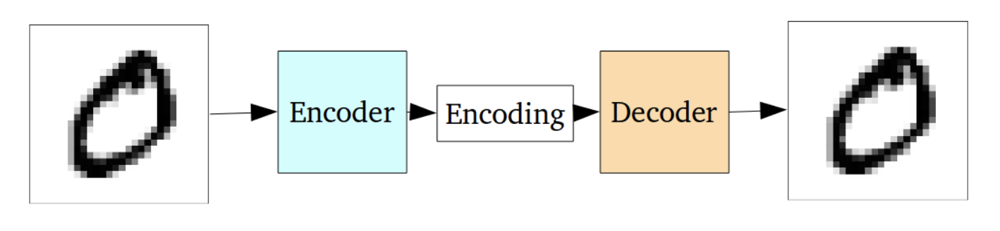
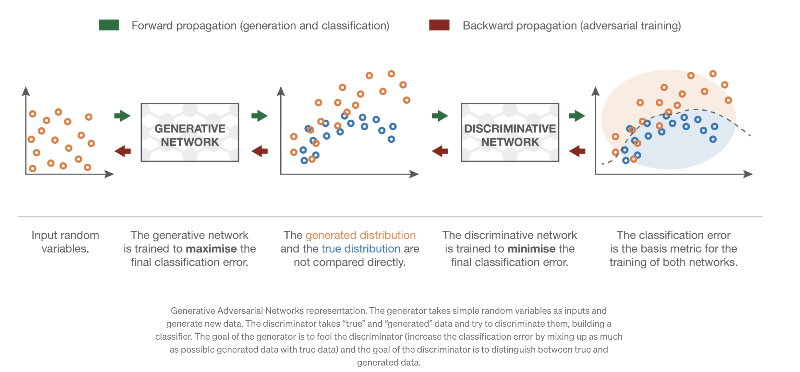

# A

## Auto-Encoder

Autoencoders are unsupervised ANN that can learn data encodings, making the encoder generate those encodings 
specifically for reconstructing its own input (See figure below.) They convert their inputs to encoded vectors that lie
in a latent space that may not be continuous or allow easy interpolation. In the end, this means that regular autoencoders 
are mostly limited to be used to generate compressed representations of their inputs, allowing to regenerate the original
input with minimal loss.

# B

## Backpropagation

A procedure to adjust the weights of a neural network by propagating the error obtained in the forward pass, backwards. 
After calculating the error in the output layer, e.g. by contrasting the output of the forward pass with the known 
so-called gold labels by means of a cost function, the gradient on the input weights of the last layer to the output units 
is calculated; then the weights of that layer are adjusted; this process is repeated backwards layer after layer until 
reaching the input layer. 

# Causality

Correlations is not causation. In ML causality tries to understand the relationships between data in order to create models
that generalize well.

# E

## Expert System

## [Explainability](vocabulary.md#Interpretability)

[See Interpretability](vocabulary.md#Interpretability).

## Explanation

The explicit ability expected in an intelligent agent to give "good" explanations of its decisions to humans. As usual,
the problem here is to define what is a "good" explanation. If we try to mimic in the intelligent agent world, how 
humans proceed giving explanations to other humans, we have to acknowledge we'll have to deal with biases and/or social
expectations. Some researchers argue {{ cite graaf_how_2017 }} that the framework of explanation of those agents will need 
to be consistent with the conceptual framework and psychological mechanisms of human behavior explanation, as humans
will expect explanations falling under those two premises.

# F

## Feature

It's a property extracted from each data instance of a dataset being observed. An example would be the "color" attribute
extracted from row coding an outfit item example from a file called seasonal_outfits.csv). Features are
crucial for many ML procesess. Selecting those features it's an art, which even has a name: [feature engineering](#feature_enginering).
Some of the properties that a good feature should have for being selected are:
- Informative about the concept that they represent
- Discriminating, to be able to separate one example instance from another 
- Independent, if possible from the other features extracted from the data instance

## Feature Engineering

The classical/traditional way of "massage" the input to pass to a ML model (e.g. a classifier.) It refers to the process 
of using domain knowledge to extract features from raw data. This was an "art" in itself usually done by domain experts.
In the age of DL, this has been substituted by the DL models themselves, which represents also the features on top of
 which the learning of a task is done.

# G

## Generalization

The capability of an already trained ML model of adapting to previously unseen data taken from the same distribution as
the data used to train it.

## Generative Adversarial Network (GAN)
A special architecture of ANN aimed to *generate new data* with similar statistics as of the ones found in a particular 
training set. The classical example of what GANs are used for, is the generation of new faces, by interpolating new
features from the data obtained from a pool of preexisting images of faces. The goal is to build the new images as real 
as possible, making them undistinguisable from real images for the human eye.

The idea is to train two models at the same time; the first one is the "generative" one, which serves as the "trend 
gatherer", that is capturing the data distribution; the second one model, called "discriminative", is trained to discern
if a particular sample comes from the training data or from the "generative" moidel {{#cite goodfellow_generative_2014}}

# I

## Interpretability

How well a human can understand the decisions (e.g. the output of a ML classifier) taken by an intelligent system in a given context.
This is related to the extent up to which humans can predict the results of a model. 

### Related

* [Ian Goodfellow Interview](https://www.technologyreview.com/2018/02/21/145289/the-ganfather-the-man-whos-given-machines-the-gift-of-imagination/)

# L

# Language Model

In any language, the words (or characters) in a sentence show certain correlations. Those correlations
 capture and contextualize the underlying semantics and characteristics of the particular language. 
 
Sequences of tokens can be found almost anywhere, being the words in a text, pixels in an image, the musical notes in
 a score, etc. A language model could be defined as a statistical model that has learnt to predict the probability of a
 sequence of tokens, capturing the correlation with other nearby tokens, either consecutive or not. In NLP, the tokens 
 use to represent words or n-grams.

The calculation of the next token in the sequence \[x_n\] can be modeled as:

\[ p(x_n | x_{n-1}, x_{n-2}...x_{1}) \]

where \[ x_i \] represents the ith token in the sequence.

# Neural Network

# Neuromorphic Computing

A computing approach which model neurons as asynchronous and independent computation units which are stimulated by the
 spikes triggered by other interconnected neurons, in a similar way as brain neurons behave.
 
Relying on asynchronous communication between the neurons, these neuromorphic systems do not need to rely on a system 
clock. So, this async communication of pulses to simulate neuron spikes is more enegy efficient, as it consumes less 
power.

# O

## Overfitting 

The effect seen in a ML model when it seems to fit the training data so closely to the target goal that its unable to 
[generalize](#Generalization) well to unseen data. When a model is said to be overfitted, usually we observe a low
error in the metrics from the train dataset and a high error in the metrics from the test dataset. 

# S

## Simulated Annealing

Inspired by the process of annealing in metal works, it describes a probabilistic approach to solve problems by 
"heating" them up and, subsequently, "cooling" them down. Let's see what this means.

The algorithmic solution of is applicable in large search domain problems with may contain several local optima points.
At the core of a simulated annealing algorithm, there's a temperature variable. This variable is set up with a high
value to simulate the heating process. As the algorithm proceeds with its iterations, the variable is allowed to be 
"cooled down". While the temperature is high, the algorithm accepts solutions that are worse than the current solution;
that means in some way that is less risk averse. This allows the algorithm to jump out from locations with local optima
that may be appear early when executing. Gradually, as the temperature decreases, the probability of accepting worse 
solutions decreases, hopefully "crystallizing" on the area of the search space where the global optimum solution is located. 

More info see {{ #cite kirkpatrick_optimization_1983 }}.

##  SVM (Support Vector Machine)

Perceptron-based classifier. SVM learns how to separate points in the space by establishing the so-called decision boundaries.
When data is separable linearly, as it shown in many examples in the ML literature, it may seem a trivial task. However, 
data in the real world is not always linearly separable, being randomly distributed, making it hard the process of segregating
the different classes linearly. The kernel trick introduced by the SVM paper performs a mathematical trick to efficiently 
(in O(n)) map -for example- data from a 2-dimensional space to 3-dimensional space, where maybe it's possible to find a 
hyperplane that separates the different classes.

# V

## Variational Auto-Encoder

In contrast to a vanilla [autoencoder](#auto-encoder), a Variational AutoEncoder (VAE) is a *generative model* 
that shares most of the architecture with a regular autoencoder, like Generative Adversarial Networks. Because of this, 
VAEs have relatively little to do with classical autoencoders (sparse or denoising autoencoders) from a mathematical
point of view.
VAEs have a special property (which we could call the "creativity" property) that makes them more interesting over 
regular autoencoders for generating outputs; their latent spaces are 
continuous by design, which allows random sampling and interpolation. In a generative model this is what you want in the
end; randomly sample from the continuous latent space in order to "distort a bit" the input image generating an image 
variation, similar to the original one, but definitely not the same.

A VAE tries to maximize the probability of each X in the training set under the entire generative process
according to \\( P(X) = \int P(X|z; \theta)P(z)dz \\)

\\( P(X|z; \theta) \\), allows making the dependence of X on z explicit by using the law of total probability. This  
framework, called "maximum likelihood", allows to assume that if the model is likely to produce training set samples, 
then it is also likely to produce similar samples, and also unlikely to produce dissimilar ones.

According to {{#cite doersch_tutorial_2016}} VAEs are called "autoencoders" because the final training objective does
share the encoder/decoder architecture, so it resembles a traditional autoencoder.